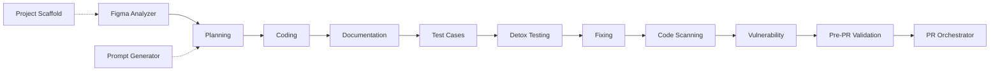

# `.cursor/` — React Native Vibe Engineering Agent System

This folder turns Cursor into an **agentic software factory** for a React Native app. It is a set of 12 specialized agents, supporting rules, a skill, helper scripts, business-brief templates, and a structured logs system. Each agent does **one job, then stops** and hands off to the next — with a human approving every step.

> **TL;DR**
> - **New project?** Start at `@project-scaffold-agent` (or `@prompt-generator-agent` Mode B).
> - **New feature/module?** Go `@figma-analyzer` → `@planning-agent` → `@coding-agent` → `@documentation-agent` → `@testcases-agent` → `@detox-testing-agent` → `@fixing-agent` → `@code-scanning-agent` → `@vulnerability-agent` → `@pre-pr-validation-agent` → `@pr-orchestrator-agent`.
> - Every agent **reads inputs from files, writes outputs to files** (mostly under `.cursor/logs/` and `.cursor/cache/`), then **stops**. Nothing auto-runs the next agent.
>
> 👉 In a hurry? Read **[`USAGE.md`](./USAGE.md)** — a one-page cheat sheet of every command, input, and output.

---

## 1. Folder structure

```
.cursor/
├── agents/            # The 12 agent definitions (the "who does what")
│   ├── agent-00-figma-analyzer.md
│   ├── agent-01-planning.md
│   ├── agent-02-coding.md
│   ├── agent-03-documentation.md
│   ├── agent-04-fixing.md
│   ├── agent-05-code-scanning.md
│   ├── agent-06-vulnerability.md
│   ├── agent-07-pr-orchestrator.md
│   ├── agent-08-project-scaffold.md
│   ├── agent-09-prompt-generator.md
│   ├── agent-10-testcases.md
│   ├── agent-11-detox-testing.md
│   ├── agent-12-pre-pr-validation.md
│   └── agent-13-useform-builder.md
├── rules/             # Always-on / glob-scoped coding & workflow rules
│   ├── agent-workflow-rules.mdc       # Agent boundaries + full sequence
│   ├── figma-to-react-native.mdc      # Figma → RN mapping rules
│   ├── react-native.mdc               # RN best practices (feature-first)
│   ├── react-native-best-practices.md
│   ├── coding-standards.md
│   ├── detox-testing.mdc              # Detox E2E config/commands
│   └── useform-validation.mdc         # Schema-based forms with the useForm hook
├── scripts/           # Node helpers (no extra deps)
│   ├── fetch-figma-nodes.js
│   ├── figma-get-nodes.js
│   ├── export-figma-svg.js
│   ├── export-figma-png.js
│   └── setup-useform.js               # Install useForm hook + validators (TS/JS)
├── skills/
│   └── react-native-architecture/SKILL.md   # App structure, aliases, design system
├── setup/
│   ├── business-briefs/               # ~10-min YAML briefs → feature prompts
│   │   ├── README.md
│   │   ├── business-brief-template.yaml
│   │   └── business-brief-template-react-native.yaml
│   ├── hooks/                         # useForm hook templates (TS + JS) + example
│   │   ├── README.md
│   │   ├── useForm.ts / useForm.js
│   │   └── useForm.example.tsx / useForm.example.js
│   └── utility/                       # form-validators.ts / form-validators.js
├── cache/             # Agent inputs/intermediate artifacts (created on demand)
│   ├── figma-specs-{feature}.md
│   ├── figma-svgs/{feature}/...
│   ├── prompt-{feature}.md
│   └── prompt-project-create-{name}.md
└── logs/              # Agent outputs (the audit trail)
    ├── prd-{feature}-{timestamp}.md
    ├── coding/coding-{feature}.md
    ├── documentation/documentation-{feature}.md
    ├── test-cases-{feature}.md
    ├── fixing/fixing-{feature}.md
    ├── code-scanning/code-scanning-{feature}-{timestamp}.md
    ├── vulnerability/vulnerability-{date}.md
    ├── detox-testing/{feature}/{timestamp}/...
    ├── project-scaffold/project-scaffold-{name}-{timestamp}.md
    ├── pre-pr/pre-pr-{branch-or-feature}-{timestamp}.md
    └── pr/pr-{feature}-{timestamp}.md
```

The repo also references a sibling `.cursornext/` folder, which is the **same agent system retargeted for Next.js** (Figma → Next.js, E2E instead of Detox, etc.). This README documents the **React Native** (`.cursor/`) system.

---

## 2. Core principle: one agent, one task, one stop

Every agent follows the same contract (see `rules/agent-workflow-rules.mdc`):

- **Does** exactly one job.
- **Does not** do the next agent's job (e.g. Planning never writes code; Coding never creates a PRD).
- **Stops** when its output file is saved, and tells you the next agent to invoke.
- **Human approval** is required between every step. No agent auto-triggers another.

This gives you a reproducible, auditable pipeline: each stage leaves a file behind, so the next stage (and you) can see exactly what happened.

---

## 3. One-time setup

### 3.1 Figma access (for Agent 00 and scripts)

The project has **no Figma MCP**, so Figma extraction/export uses the **Figma REST API**, which needs a token.

1. Get a token: Figma → **Settings → Account → Personal access tokens**.
2. Copy `.env.example` → `.env` in the project root and add:
   ```
   FIGMA_ACCESS_TOKEN=your-token-here
   ```
3. **Never commit** the token. All scripts auto-load `.env` (no `dotenv` dependency needed).

Without a token, Agent 00 still produces a spec but **lists assets instead of exporting them**, with a note to set the token and re-run.

### 3.2 Optional integrations

| Tool | Used by | How to enable |
|------|---------|---------------|
| **ESLint** | `@code-scanning-agent` | Add `eslint` + a `lint` script in `package.json`. |
| **SonarQube** | `@code-scanning-agent` | Add `sonar-project.properties` + set `SONAR_HOST_URL`, `SONAR_TOKEN`. |
| **Snyk** | `@vulnerability-agent` | `npx snyk auth` or set `SNYK_TOKEN` in `.env`. |
| **Detox** | `@fixing-agent` (test mode), `@detox-testing-agent` | `.detoxrc.js`, `e2e/**/*.e2e.js`, `npm run e2e:ios|android`. |
| **Jest + RNTL** | `@testcases-agent`, `@fixing-agent` | `jest.config.js`, `jest.setup.js`, `__tests__/*.test.js`. |

---

## 4. The agents — what they do, inputs, outputs, and what happens when you run them

Invoke an agent by typing `@<agent-name>` in Cursor with the required info. Below, **"After running"** describes exactly what the agent produces and where it stops.

### Agent 08 — Project Scaffold (`@project-scaffold-agent`)
- **Input:** App name (e.g. `MyApp`); optional folder name.
- **Does:** Runs the **React Native Community CLI** (`npx @react-native-community/cli init <Name> --skip-install`) from the **parent of the workspace** (creates the project as a **sibling**, outside the current workspace). Then adds the `src/` folder structure + boilerplate (Root.js, AppRouteConfig.js, path aliases, COLORS/fonts/commonStyles, sample Home screen, Common store slice, **the `useForm` hook + `form-validators`**), and merges navigation/redux deps into `package.json`, aliases into `babel.config.js`, and `paths` into `tsconfig.json`.
- **After running:** A new TypeScript RN project exists outside the workspace with boilerplate; log saved to `logs/project-scaffold/project-scaffold-{name}-{timestamp}.md`. **You** then run `npm install` and `cd ios && pod install`.
- **Does not:** Run `npm install`/`pod install`, create feature code, or touch `package.json`/`index.js` from scratch.

### Agent 09 — Prompt Generator (`@prompt-generator-agent`)
- **Two modes:**
  - **Mode A (feature prompt):** Reads a business brief YAML (+ optional Figma specs) and writes a ready-to-use prompt for the Planning Agent → `cache/prompt-{feature}.md`.
  - **Mode B (project prompt):** Writes a project-creation prompt that points you to `@project-scaffold-agent` → `cache/prompt-project-create-{name}.md`.
- **After running:** A prompt file is saved; the agent tells you to feed it to `@planning-agent` (A) or `@project-scaffold-agent` (B).
- **Does not:** Create a PRD, write code, run CLI, or run Figma.

### Agent 00 — Figma Analyzer (`@figma-analyzer`)
- **Input (4 required):** Feature name (kebab-case), Mobile Figma URL (with `node-id`), Mobile Frame name, Section description.
- **Does:** Extracts the **mobile frame only** (hierarchy, measurements, colors, typography **incl. fontWeight**, spacing) and maps to RN tokens (ColorCode/COLORS, FONTS/fontFamily+fontSize). **Automatically** exports every icon (SVG) and image (PNG) found in the frame: SVGs → `cache/figma-svgs/{feature}/`, PNGs → Android `drawable/` + iOS `Images.xcassets/`.
- **After running:** Spec saved to `cache/figma-specs-{feature}.md`; assets exported (or listed with a "set FIGMA_ACCESS_TOKEN" note). Stops; hand off to Planning or Coding.
- **Does not:** Create a PRD or write code.

### Agent 01 — Planning (`@planning-agent`)
- **Input:** A prompt (`cache/prompt-{feature}.md`), Figma specs (`cache/figma-specs-{feature}.md`), a Figma URL, or a written description.
- **Does:** Loads the RN architecture skill + rules, then writes a full **PRD** (10 mandatory sections: communication history, overview, functional/technical requirements, RN implementation, design specs, notes, validation, testing, acceptance).
- **After running:** PRD saved to `logs/prd-{feature}-{timestamp}.md`. Stops; hand off to `@coding-agent`.
- **Does not:** Write code or run tests.

### Agent 02 — Coding (`@coding-agent`)
- **Input:** Approved PRD path (+ optional Figma specs).
- **Does:** Reads the PRD, **creates the coding log before writing code**, loads the architecture skill + rules, then implements files under `src/` using path aliases, design tokens (no raw hex/fonts), TITLES/ALERTS constants, IMAGES registry, shadow/elevation, a11y, SafeArea/KeyboardAvoidingView, etc. Runs lint/type checks. If a native dep is added, runs `npm install` (+ `pod install`) and documents rebuild steps.
- **After running:** Source files created/modified; coding log saved/updated at `logs/coding/coding-{feature}.md` with validation results. Stops; hand off to `@documentation-agent` or `@fixing-agent`.
- **Does not:** Create a PRD or run E2E.

### Agent 13 — useForm Builder (`@useform-builder-agent`)
- **Input:** Form/feature name + field list (name, type, required, rules) + target screen/component path.
- **Does:** Builds or refactors a form with the project's schema-based **`useForm`** hook — RN field handlers (`(name, value)`), `dirty`-gated errors, `ALERTS` validation messages, shared validators in `utility/form-validators`, and a service-layer submit (`.then()/.catch()`). Detects **TypeScript** (`.tsx`, typed with `FormSchema`) vs **JavaScript**. If the hook is missing it runs `node .cursor/scripts/setup-useform.js` (installs `src/hooks/useForm` + `src/utility/form-validators`, TS or JS).
- **After running:** Form screen/component + styles created; coding log at `logs/coding/coding-{feature}.md`. Stops; hand off to `@documentation-agent` / `@fixing-agent`.
- **Does not:** Create a PRD, run E2E, or add new form libraries (no Formik/react-hook-form/yup).
- **Setup:** Hook templates live in `setup/hooks/` (TS + JS); rules in `rules/useform-validation.mdc`. The **Project Scaffold Agent** installs `useForm` automatically for every new project.
- **Example:**

```
@useform-builder-agent

Form: login
Fields: email (required), password (required, min 6)
Path: src/screens/Login
```

  → creates `src/screens/Login/index.tsx` + `style.ts` using `useForm` (schema typed with `FormSchema`), `ALERTS.VALIDATION.*` error messages, submit via a service, and a coding log at `logs/coding/coding-login.md`.

### Agent 03 — Documentation (`@documentation-agent`)
- **Input:** Files to document (explicit list, or from the coding log).
- **Does:** Adds JSDoc, file headers, and inline comments **without changing any logic or styles**.
- **After running:** Files updated with docs; optional doc log at `logs/documentation/documentation-{feature}.md`. Stops.
- **Does not:** Fix bugs, refactor, or change behavior.

### Agent 10 — Test Case Authoring (`@testcases-agent`)
- **Input:** Feature name + PRD path + coding log path (optional Figma specs).
- **Does:** Writes a **manual QA test-case doc** (`logs/test-cases-{feature}.md`, TC-IDs with priority/steps/expected/testIDs) and, by default, a **Jest test file** (`__tests__/{Feature}.test.js`) mapping `it('TC-001: …')` to each case.
- **After running:** Test-cases file (+ Jest file) created; tells you `@fixing-agent` can now run "Test {feature}". Stops.
- **Does not:** Run Detox E2E or fix code.

### Agent 11 — Detox Testing (`@detox-testing-agent`)
- **Input:** Feature name (or "entire app") + **testing target** (iOS Simulator / Android Emulator / Both). Stops and asks if target is missing.
- **Setup:** Full Detox setup (iOS + Android native wiring, troubleshooting, new-project checklist) is in **`docs/DETOX-INTEGRATION.md`**. The agent verifies setup (STEP 0) before running and stops if a piece is missing.
- **Does:** Creates `e2e/{feature}-flows.e2e.js` if missing (flow-based journeys), ensures the app is built, **runs Detox automatically**, captures screenshots/videos, and writes a results file with issues + **recommendations only** (root cause, file/line, before/after code).
- **After running:** Results at `logs/detox-testing/{feature}/{timestamp}/test-results.md` (+ `screenshots/`, `videos/`). Stops; hand off to `@fixing-agent` for fixes.
- **Does not:** Modify source code.

### Agent 04 — Fixing (`@fixing-agent`)
- **Two modes:**
  - **Fix-only:** "Fix X" → reads coding log + code, applies **simple** fixes (typos, optional chaining, style tokens, import/alias, missing testID/a11y, shadow/elevation, native dep install + pod install, top safe-area header, missing PNG notes).
  - **Test-and-fix:** "Test {feature}" + testing target → requires `logs/test-cases-{feature}.md`, runs **Jest** (and **Detox/Maestro** if configured), tracks pass/fail by TC-ID and priority, fixes simple failures, re-runs.
- **After running:** Fixes applied; fixing log saved/updated at `logs/fixing/fixing-{feature}.md` with results by TC-ID. Complex issues documented as "Requires Coding Agent". Stops.
- **Does not:** Create a PRD, implement new features, or run without a test-cases file in test mode.

### Agent 05 — Code Scanning (`@code-scanning-agent`)
- **Input:** Feature name or file scope.
- **Does:** Runs an 8-category RN quality checklist (structure, design system, aliases, styling/platform, state, a11y, performance, compliance), runs **ESLint** (and **SonarQube** if configured), scores and prioritizes (P1/P2/P3).
- **After running:** Report saved to `logs/code-scanning/code-scanning-{feature}-{timestamp}.md` + summary in chat. Stops. **Does not fix code.**

### Agent 06 — Vulnerability (`@vulnerability-agent`)
- **Input:** Project root (default) or feature context.
- **Does:** Runs `npm audit` (and **Snyk** if configured), categorizes by severity → P1–P4 with remediation.
- **After running:** Report saved to `logs/vulnerability/vulnerability-{date}.md` + chat summary. Stops. **Does not apply fixes.**

### Agent 12 — Pre-PR Validation (`@pre-pr-validation-agent`)
- **Input:** Current branch / working tree; optional base branch (default `main`), feature name, or file scope.
- **Does:** Reviews **only the changed files** (`git diff` vs base) plus related dependents for context. Validates seven areas — code quality & best practices, folder-structure compliance, React/React Native (and Next.js if present) performance, security & insecure patterns, TypeScript/lint/test (scoped), PR readiness, and potential **breaking changes** — then runs scoped ESLint/type check/Jest and produces P1/P2/P3 findings with a **READY / NOT READY** verdict.
- **After running:** Report saved to `logs/pre-pr/pre-pr-{branch-or-feature}-{timestamp}.md` + chat summary. Stops. **Recommendations only — does not modify code.** Hand off fixes to `@fixing-agent` / `@coding-agent`, then run `@pr-orchestrator-agent`.
- **Does not:** Fix/refactor code, review the whole codebase, or create/commit/submit/merge a PR.

### Agent 07 — PR Orchestrator (`@pr-orchestrator-agent`)
- **Input:** Feature name (gathers PRD, coding log, fixing log, scans automatically).
- **Does:** Generates a PR document (overview, changes, testing, quality/security summary).
- **After running:** PR doc saved to `logs/pr/pr-{feature}-{timestamp}.md`. Stops. **Does not submit or merge the PR.**
- **Tip:** Run `@pre-pr-validation-agent` first to confirm the changes are READY, then use this agent to write the PR document.

---

## 5. Sequences

### 5.1 Sequence for a brand-new project

```
(optional) @prompt-generator-agent  (Mode B)   →  cache/prompt-project-create-{name}.md
@project-scaffold-agent  "Create project MyApp" →  ../MyApp/ (sibling) + boilerplate + scaffold log
        ↓  (you run)
npm install   &&   cd ios && pod install   &&   npm run ios | npm run android
        ↓
proceed to the per-feature sequence below for each screen/module
```

### 5.2 Sequence for a new module / feature

```
1.  @figma-analyzer          → cache/figma-specs-{feature}.md  (+ exported SVG/PNG assets)
1b. (fill business brief)    → setup/business-briefs/business-brief-{feature}.yaml
1c. @prompt-generator-agent  → cache/prompt-{feature}.md           (optional, Mode A)
2.  @planning-agent          → logs/prd-{feature}-{timestamp}.md
3.  @coding-agent            → src/... + logs/coding/coding-{feature}.md
4.  @documentation-agent     → JSDoc/comments + (optional) doc log
5.  @testcases-agent         → logs/test-cases-{feature}.md + __tests__/{Feature}.test.js   (optional)
6.  @detox-testing-agent     → logs/detox-testing/{feature}/{timestamp}/test-results.md       (optional)
7.  @fixing-agent            → fixes + logs/fixing/fixing-{feature}.md
8.  @code-scanning-agent     → logs/code-scanning/code-scanning-{feature}-{timestamp}.md
9.  @vulnerability-agent     → logs/vulnerability/vulnerability-{date}.md
10. @pre-pr-validation-agent → logs/pre-pr/pre-pr-{branch-or-feature}-{timestamp}.md   (before raising the PR)
11. @pr-orchestrator-agent   → logs/pr/pr-{feature}-{timestamp}.md
```

Each step is **manually invoked** and **stops** when done. Skip optional steps (1b/1c, 5, 6) if you don't need them. The minimum viable path for a designed feature is: **Figma → Planning → Coding → Fixing**.



---

## 6. Quick invocation reference

| Agent | Invoke | Provide | Output |
|-------|--------|---------|--------|
| 08 Scaffold | `@project-scaffold-agent` | App name (+ optional folder) | New RN project (sibling) + scaffold log |
| 09 Prompt Gen | `@prompt-generator-agent` | Feature+brief (A) or project name (B) | `cache/prompt-*.md` |
| 00 Figma | `@figma-analyzer` | Feature, Mobile URL+node-id, Frame, Section | `cache/figma-specs-{feature}.md` + assets |
| 01 Planning | `@planning-agent` | Prompt/specs path or description | `logs/prd-{feature}-{ts}.md` |
| 02 Coding | `@coding-agent` | PRD path | `src/...` + `logs/coding/coding-{feature}.md` |
| 13 useForm | `@useform-builder-agent` | Form name + fields + path | Form (`useForm`) + `logs/coding/coding-{feature}.md` |
| 03 Docs | `@documentation-agent` | Files or coding log | Documented files + doc log |
| 10 Test Cases | `@testcases-agent` | Feature + PRD + coding log | `logs/test-cases-{feature}.md` + Jest file |
| 11 Detox | `@detox-testing-agent` | Feature + testing target | `logs/detox-testing/.../test-results.md` |
| 04 Fixing | `@fixing-agent` | "Fix X" or "Test {feature}" + target | `logs/fixing/fixing-{feature}.md` |
| 05 Scan | `@code-scanning-agent` | Feature or scope | `logs/code-scanning/...md` |
| 06 Vuln | `@vulnerability-agent` | (project root) | `logs/vulnerability/vulnerability-{date}.md` |
| 12 Pre-PR | `@pre-pr-validation-agent` | (optional base branch) | `logs/pre-pr/pre-pr-{branch-or-feature}-{ts}.md` + verdict |
| 07 PR | `@pr-orchestrator-agent` | Feature | `logs/pr/pr-{feature}-{ts}.md` |

**Example invocations (per agent)**

```
@project-scaffold-agent
Create project MyApp
```

```
@prompt-generator-agent
Mode A: Generate a Planning prompt for feature forgot-password-screen
from setup/business-briefs/business-brief-forgot-password-screen.yaml
and cache/figma-specs-forgot-password-screen.md
```

```
@figma-analyzer
Feature name: forgot-password-screen
Mobile URL: https://www.figma.com/design/ABC123/App?node-id=10-8700
Mobile Frame: M_Forgot_Password_Screen
Section: Forgot password screen – layout, fields, buttons, copy, icons
```

```
@planning-agent
Plan feature: forgot-password-screen from .cursor/cache/figma-specs-forgot-password-screen.md
```

```
@coding-agent
Implement PRD from .cursor/logs/prd-forgot-password-screen-20260202-143000.md
```

```
@documentation-agent
Document the files from .cursor/logs/coding/coding-forgot-password-screen.md
```

```
@testcases-agent
Author test cases for forgot-password-screen
PRD: .cursor/logs/prd-forgot-password-screen-20260202-143000.md
Coding log: .cursor/logs/coding/coding-forgot-password-screen.md
```

```
@detox-testing-agent
Run E2E for forgot-password-screen
Testing target: iOS Simulator
```

```
@fixing-agent
Test forgot-password-screen.
Testing target: iOS Simulator
```

```
@code-scanning-agent
Scan quality for forgot-password-screen
```

```
@vulnerability-agent
Scan dependencies for vulnerabilities
```

```
@pre-pr-validation-agent
Validate my changes before raising a PR (base: main).
```

```
@pr-orchestrator-agent
Create the PR document for forgot-password-screen
```

**End-to-end worked example — adding a `forgot-password-screen`**

This is the full happy path from a Figma design to a PR document. Each line is a **separate** prompt you send; you review the saved file before moving on.

```
1) @figma-analyzer
   Feature name: forgot-password-screen
   Mobile URL: https://www.figma.com/design/ABC123/App?node-id=10-8700
   Mobile Frame: M_Forgot_Password_Screen
   Section: Forgot password screen – layout, fields, buttons, copy, icons
   → writes  cache/figma-specs-forgot-password-screen.md  (+ exported SVG/PNG assets)

2) @planning-agent
   Plan feature: forgot-password-screen from .cursor/cache/figma-specs-forgot-password-screen.md
   → writes  logs/prd-forgot-password-screen-20260202-143000.md

3) @coding-agent
   Implement PRD from .cursor/logs/prd-forgot-password-screen-20260202-143000.md
   → writes  src/screens/ForgotPassword/... + logs/coding/coding-forgot-password-screen.md

4) @documentation-agent
   Document the files from .cursor/logs/coding/coding-forgot-password-screen.md
   → adds JSDoc/comments (no logic changes)

5) @testcases-agent
   Author test cases for forgot-password-screen (PRD + coding log paths)
   → writes  logs/test-cases-forgot-password-screen.md + __tests__/ForgotPassword.test.js

6) @fixing-agent
   Test forgot-password-screen.   Testing target: iOS Simulator
   → runs Jest, fixes simple failures, writes logs/fixing/fixing-forgot-password-screen.md

7) @code-scanning-agent     →  logs/code-scanning/code-scanning-forgot-password-screen-<ts>.md
8) @vulnerability-agent     →  logs/vulnerability/vulnerability-<date>.md

9) @pre-pr-validation-agent
   Validate my changes before raising a PR (base: main).
   → writes  logs/pre-pr/pre-pr-forgot-password-screen-<ts>.md  (READY / NOT READY)
   → if NOT READY: hand fixes back to @fixing-agent / @coding-agent, then re-run step 9

10) @pr-orchestrator-agent
    Create the PR document for forgot-password-screen
    → writes  logs/pr/pr-forgot-password-screen-<ts>.md
```

> **Minimum viable path** for an already-designed feature: `@figma-analyzer` → `@planning-agent` → `@coding-agent` → `@fixing-agent`. Steps 4, 5, 7, 8 are optional polish/quality gates.

> For a fast lookup of just the commands and outputs, see **[`USAGE.md`](./USAGE.md)** — the concise cheat sheet.

---

## 7. Rules, skill, scripts, and setup

### Rules (`rules/`)
- **`agent-workflow-rules.mdc`** — Defines each agent's boundaries and the full workflow sequence (always applied).
- **`figma-to-react-native.mdc`** — Mapping rules: Figma frame → `View`, auto-layout → flex/gap, colors → ColorCode/COLORS, text → FONTS (with mandatory fontWeight), effects → shadow/elevation (always applied).
- **`react-native.mdc` / `react-native-best-practices.md`** — Feature-first structure, StyleSheet co-location, performance (FlatList/FlashList, memoization), a11y, error handling (glob-scoped to JS/TS files).
- **`coding-standards.md`** — Naming, import order, DRY, optional chaining, project structure conventions.
- **`detox-testing.mdc`** — Detox config (`.detoxrc.js`), spec location (`e2e/**/*.e2e.js`), and commands used by the testing agents.
- **`useform-validation.mdc`** — Schema-based forms with the `useForm` hook: schema shape, RN `(name, value)` handlers, `dirty`-gated errors, validator factories, checklist (glob-scoped to JS/TS files).

> Note: these `.cursor/rules/` files are the **shared knowledge base** the agents read. The repo-level user rules (folder structure, styled-components, i18n, optional chaining, no-comments, etc.) also apply to all generated code.

### Skill (`skills/react-native-architecture/SKILL.md`)
The canonical reference for **app structure**, **path aliases** (`@`, `@components`, `@screens`, `@constants`, `@store`, `@utility`, `@api`, `@assets`, `@layouts`, `@widgets`, `@hooks`), and the **design system** (COLORS, fontFamily/fontSize, commonStyles). Planning, Coding, Scaffold, and Prompt agents all load this first.

### Scripts (`scripts/`) — run from project root, auto-load `.env`
| Script | Purpose | Example |
|--------|---------|---------|
| `fetch-figma-nodes.js` | Save a node's full document JSON to cache | `node .cursor/scripts/fetch-figma-nodes.js <fileKey> <nodeId> [outfile]` |
| `figma-get-nodes.js` | Fetch node(s) → `cache/figma-node-{name}.json` | `node .cursor/scripts/figma-get-nodes.js <nodeId> [fileKey] [name]` |
| `export-figma-svg.js` | Export a node as SVG → `cache/figma-svgs/{feature}/` | `node .cursor/scripts/export-figma-svg.js <feature> <nodeId> [fileKey]` |
| `export-figma-png.js` | Export PNG → Android `drawable/` + iOS `Images.xcassets/` | `node .cursor/scripts/export-figma-png.js <nodeId> <android_name> <IosImageSet> [fileKey]` |
| `setup-useform.js` | Install the `useForm` hook + `form-validators` into `src/` (TS or JS) | `node .cursor/scripts/setup-useform.js [--ts\|--js] [--force]` |

The Figma scripts require `FIGMA_ACCESS_TOKEN` (or `FIGMA_TOKEN`) in `.env` or the environment. `setup-useform.js` needs no token and no extra deps.

### Setup (`setup/business-briefs/`)
A ~10-minute YAML brief that captures business context (purpose, rules, customization, success metrics). Copy `business-brief-template-react-native.yaml` → `business-brief-{feature}.yaml`, fill it, then feed it to `@prompt-generator-agent` (Mode A) to generate a Planning prompt. See that folder's `README.md` for the flow.

### Setup (`setup/hooks/` + `setup/utility/`)
Templates for the schema-based **`useForm`** hook and its validators, in **TypeScript** and **JavaScript**. Install with `node .cursor/scripts/setup-useform.js` (auto-detects TS via `tsconfig.json`; `--ts`/`--js` to force) — it copies `useForm` into `src/hooks/`, `form-validators` into `src/utility/`, and wires the `src/hooks` barrel. The hook has **no external dependencies** and uses RN `(name, value)` handlers with `ALERTS`-based error messages. The Project Scaffold Agent installs it automatically. Build forms with `@useform-builder-agent` (see `rules/useform-validation.mdc` and `setup/hooks/README.md`).

---

## 8. Outputs map (where to look after each agent)

| You ran… | Look here |
|----------|-----------|
| Figma Analyzer | `cache/figma-specs-{feature}.md`, `cache/figma-svgs/{feature}/`, native asset folders |
| Prompt Generator | `cache/prompt-{feature}.md` or `cache/prompt-project-create-{name}.md` |
| Planning | `logs/prd-{feature}-{timestamp}.md` |
| Coding | `src/...` + `logs/coding/coding-{feature}.md` |
| Documentation | updated source files + `logs/documentation/documentation-{feature}.md` |
| Test Cases | `logs/test-cases-{feature}.md` + `__tests__/{Feature}.test.js` |
| Detox Testing | `logs/detox-testing/{feature}/{timestamp}/test-results.md` (+ screenshots/videos) |
| Fixing | `logs/fixing/fixing-{feature}.md` |
| Code Scanning | `logs/code-scanning/code-scanning-{feature}-{timestamp}.md` |
| Vulnerability | `logs/vulnerability/vulnerability-{date}.md` |
| Pre-PR Validation | `logs/pre-pr/pre-pr-{branch-or-feature}-{timestamp}.md` (READY / NOT READY verdict) |
| PR Orchestrator | `logs/pr/pr-{feature}-{timestamp}.md` |
| Project Scaffold | new sibling project + `logs/project-scaffold/project-scaffold-{name}-{timestamp}.md` |

---

## 9. FAQ

- **Do agents run automatically one after another?** No. You invoke each one and approve its output. Agents only *suggest* the next step.
- **What if an input file is missing?** Agents stop and tell you exactly what's needed (e.g. Coding stops if no PRD; Fixing-test stops if no test-cases file or testing target).
- **Where do agents save things?** Inputs/intermediate → `.cursor/cache/`; outputs/audit trail → `.cursor/logs/`; generated app code → `src/`, `__tests__/`, `e2e/`, native asset folders.
- **Can I skip steps?** Yes. Optional steps are 1b/1c (brief/prompt), 5 (test cases), 6 (Detox). Minimum designed-feature path: Figma → Planning → Coding → Fixing.
- **What about Next.js?** The sibling `.cursornext/` folder mirrors this system for Next.js (Figma → Next.js rules, generic E2E instead of Detox).
```
