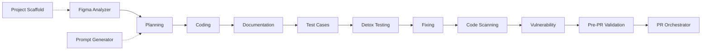

# `.cursor/` — React Native Vibe Engineering Agent System

This folder turns Cursor into an **agentic software factory** for a React Native app. It is a set of 22 agents (00–21, incl. Ponytail), supporting rules, a skill, helper scripts, business-brief templates, and a structured logs system. Each agent does **one job, then stops** and hands off to the next — with a human approving every step.

> **TL;DR**
> - **New project?** `@project-scaffold-agent` (or `@prompt-generator-agent` Mode B).
> - **New feature/module?** `@figma-analyzer` → `@planning-agent` → `@coding-agent` → `@documentation-agent` → `@testcases-agent` → `@detox-testing-agent` → `@fixing-agent` → `@code-scanning-agent` → `@vulnerability-agent` → `@pre-pr-validation-agent` → `@pr-orchestrator-agent`.
> - Every agent **reads inputs from files, writes outputs to files** (mostly under `.cursor/logs/` and `.cursor/cache/`), then **stops**. Nothing auto-runs the next agent.
>
> 👉 Copy-paste commands for every agent: **[`USAGE.md`](./USAGE.md)**. Side-by-side RN/Next.js overview: **[root `README.md`](../README.md)**. Next.js kit: **[`.cursornext/README.md`](../.cursornext/README.md)**.

---

## Table of contents

1. [Folder structure](#1-folder-structure)
2. [Core principle](#2-core-principle-one-agent-one-task-one-stop)
3. [One-time setup](#3-one-time-setup)
4. [Agents (detailed)](#4-agents--what-they-do)
5. [Workflows](#5-workflows)
6. [Agent reference](#6-agent-reference)
7. [Worked example](#7-worked-example--forgot-password-screen)
8. [Rules, skill, scripts & setup](#8-rules-skill-scripts--setup)
9. [Outputs map](#9-outputs-map)
10. [FAQ](#10-faq)

---

## 1. Folder structure

```
.cursor/
├── agents/            # Agent definitions 00–21 (the "who does what")
│   ├── agent-00-figma-analyzer.md
│   ├── agent-01-planning.md
│   ├── agent-02-coding.md
│   ├── agent-03-documentation.md
│   ├── agent-04-fixing.md
│   ├── agent-05-code-scanning.md
│   ├── agent-06-vulnerability.md
│   ├── agent-07-pr-orchestrator.md
│   ├── agent-08-project-scaffold.md
│   ├── agent-09-prompt-generator.md
│   ├── agent-10-testcases.md
│   ├── agent-11-detox-testing.md
│   ├── agent-12-pre-pr-validation.md
│   ├── agent-13-useform-builder.md
│   ├── agent-14-fetch-client.md
│   ├── agent-15-user-story-testcases.md
│   ├── agent-16-unit-test-analysis.md
│   ├── agent-17-npm-audit-auto-fix.md
│   ├── agent-18-error-pages.md
│   ├── agent-19-socket-setup.md
│   ├── agent-20-keyboard-layout.md
│   └── agent-21-ponytail.md
├── rules/             # Always-on / glob-scoped coding & workflow rules
│   ├── agent-workflow-rules.mdc       # Agent boundaries + full sequence
│   ├── figma-to-react-native.mdc      # Figma → RN mapping rules
│   ├── ui-qa-checklist.mdc            # Static UI QA while coding
│   ├── keyboard-layout.mdc            # KeyboardAwareLayout / ChatKeyboardLayout
│   ├── react-native.mdc               # RN best practices (feature-first)
│   ├── react-native-best-practices.md
│   ├── coding-standards.md
│   ├── detox-testing.mdc              # Detox E2E config/commands
│   └── useform-validation.mdc         # Schema-based forms with useForm
├── scripts/           # Node helpers (no extra deps)
│   ├── fetch-figma-nodes.js
│   ├── figma-get-nodes.js
│   ├── export-figma-svg.js
│   ├── export-figma-png.js
│   ├── setup-useform.js
│   ├── setup-fetch.js
│   ├── setup-error-pages.js
│   ├── setup-keyboard-layout.js
│   ├── setup-socket.js
│   └── npm-audit-auto-fix.js
├── skills/
│   └── react-native-architecture/SKILL.md
├── setup/
│   ├── business-briefs/
│   ├── hooks/                         # useForm templates (TS + JS)
│   ├── utility/                       # form-validators
│   ├── error-pages/
│   ├── keyboard/
│   └── socket/
├── cache/             # Inputs/intermediate artifacts (on demand)
└── logs/              # Agent outputs (audit trail)
```

The sibling [`.cursornext/`](../.cursornext/) folder is the **same agent system retargeted for Next.js** (Playwright instead of Detox, etc.). This README documents **React Native** only.

---

## 2. Core principle: one agent, one task, one stop

Every agent follows the same contract (see `rules/agent-workflow-rules.mdc`):

- **Does** exactly one job.
- **Does not** do the next agent's job (e.g. Planning never writes code; Coding never creates a PRD).
- **Stops** when its output file is saved, and tells you the next agent to invoke.
- **Human approval** is required between every step. No agent auto-triggers another.

This gives you a reproducible, auditable pipeline: each stage leaves a file behind, so the next stage (and you) can see exactly what happened.

---

## 3. One-time setup

### 3.1 Figma access (for Agent 00 and scripts)

The project has **no Figma MCP**, so Figma extraction/export uses the **Figma REST API**, which needs a token.

1. Get a token: Figma → **Settings → Account → Personal access tokens**.
2. Create **`.env`** in the project root and add:
   ```
   FIGMA_ACCESS_TOKEN=your-token-here
   API_BASE_URL=
   ```
3. **Never commit** `.env`. All scripts auto-load `.env` only (no `dotenv` dependency needed).

Without a token, Agent 00 still produces a spec but **lists assets instead of exporting them**, with a note to set the token and re-run.

### 3.2 Optional integrations

| Tool | Used by | How to enable |
|------|---------|---------------|
| **ESLint** | `@code-scanning-agent` | Add `eslint` + a `lint` script in `package.json`. |
| **SonarQube** | `@code-scanning-agent` | Add `sonar-project.properties` + set `SONAR_HOST_URL`, `SONAR_TOKEN`. |
| **Snyk** | `@vulnerability-agent` | `npx snyk auth` or set `SNYK_TOKEN` in `.env`. |
| **Detox** | `@fixing-agent` (test mode), `@detox-testing-agent` | `.detoxrc.js`, `e2e/**/*.e2e.js`, `npm run e2e:ios\|android`. See [`docs/DETOX-INTEGRATION.md`](../docs/DETOX-INTEGRATION.md). |
| **Jest + RNTL** | `@testcases-agent`, `@fixing-agent` | `jest.config.js`, `jest.setup.js`, `__tests__/*.test.js`. |

---

## 4. Agents — what they do

Invoke an agent by typing `@<agent-name>` in Cursor with the required info. **"After running"** describes exactly what the agent produces and where it stops.

### Agent 00 — Figma Analyzer (`@figma-analyzer`)
- **Input (4 required):** Feature name (kebab-case), Mobile Figma URL (with `node-id`), Mobile Frame name, Section description.
- **Does:** Extracts the **mobile frame only** (hierarchy, measurements, colors, typography **incl. fontWeight**, spacing) and maps to RN tokens (ColorCode/COLORS, FONTS/fontFamily+fontSize). **Automatically** exports every icon (SVG) and image (PNG): SVGs → `cache/figma-svgs/{feature}/`, PNGs → Android `drawable/` + iOS `Images.xcassets/`.
- **After running:** Spec saved to `cache/figma-specs-{feature}.md`; assets exported (or listed with a "set FIGMA_ACCESS_TOKEN" note). Stops; hand off to Planning or Coding.
- **Does not:** Create a PRD or write code.

### Agent 01 — Planning (`@planning-agent`)
- **Input:** A prompt (`cache/prompt-{feature}.md`), Figma specs (`cache/figma-specs-{feature}.md`), a Figma URL, or a written description.
- **Does:** Loads the RN architecture skill + rules, then writes a full **PRD** (10 mandatory sections: communication history, overview, functional/technical requirements, RN implementation, design specs, notes, validation, testing, acceptance).
- **After running:** PRD saved to `logs/prd-{feature}-{timestamp}.md`. Stops; hand off to `@coding-agent`.
- **Does not:** Write code or run tests.

### Agent 02 — Coding (`@coding-agent`)
- **Input:** Approved PRD path (+ optional Figma specs).
- **Does:** Reads the PRD, **creates the coding log before writing code**, loads the architecture skill + rules (incl. **`ui-qa-checklist.mdc`**), then implements files under `src/` using path aliases, design tokens (no raw hex/fonts), TITLES/ALERTS constants, IMAGES registry, shadow/elevation, a11y, SafeArea/KeyboardAvoidingView, etc. Validates UI QA checklist in coding log. Runs lint/type checks. If a native dep is added, runs `npm install` (+ `pod install`) and documents rebuild steps.
- **After running:** Source files created/modified; coding log at `logs/coding/coding-{feature}.md` with validation results. Stops; hand off to `@documentation-agent` or `@fixing-agent`.
- **Does not:** Create a PRD or run E2E.

### Agent 03 — Documentation (`@documentation-agent`)
- **Input:** Files to document (explicit list, or from the coding log).
- **Does:** Adds JSDoc, file headers, and inline comments **without changing any logic or styles**.
- **After running:** Files updated with docs; optional doc log at `logs/documentation/documentation-{feature}.md`. Stops.
- **Does not:** Fix bugs, refactor, or change behavior.

### Agent 04 — Fixing (`@fixing-agent`)
- **Two modes:**
  - **Fix-only:** "Fix X" → reads coding log + code, applies **simple** fixes (typos, optional chaining, style tokens, import/alias, missing testID/a11y, shadow/elevation, native dep install + pod install, top safe-area header, missing PNG notes).
  - **Test-and-fix:** "Test {feature}" + testing target → requires `logs/test-cases-{feature}.md`, runs **Jest** (and **Detox/Maestro** if configured), tracks pass/fail by TC-ID and priority, fixes simple failures, re-runs.
- **After running:** Fixes applied; fixing log at `logs/fixing/fixing-{feature}.md` with results by TC-ID. Complex issues documented as "Requires Coding Agent". Stops.
- **Does not:** Create a PRD, implement new features, or run without a test-cases file in test mode.

### Agent 05 — Code Scanning (`@code-scanning-agent`)
- **Input:** Feature name or file scope.
- **Does:** Runs an 8-category RN quality checklist (structure, design system, aliases, styling/platform, state, a11y, performance, compliance), runs **ESLint** (and **SonarQube** if configured), scores and prioritizes (P1/P2/P3).
- **After running:** Report at `logs/code-scanning/code-scanning-{feature}-{timestamp}.md` + summary in chat. Stops. **Does not fix code.**

### Agent 06 — Vulnerability (`@vulnerability-agent`)
- **Input:** Project root (default) or feature context.
- **Does:** Runs `npm audit` (and **Snyk** if configured), categorizes by severity → P1–P4 with remediation.
- **After running:** Report at `logs/vulnerability/vulnerability-{date}.md` + chat summary. Stops. **Does not apply fixes.**

### Agent 07 — PR Orchestrator (`@pr-orchestrator-agent`)
- **Input:** Feature name (gathers PRD, coding log, fixing log, scans automatically).
- **Does:** Generates a PR document (overview, changes, testing, quality/security summary).
- **After running:** PR doc at `logs/pr/pr-{feature}-{timestamp}.md`. Stops. **Does not submit or merge the PR.**
- **Tip:** Run `@pre-pr-validation-agent` first to confirm READY, then use this agent.

### Agent 08 — Project Scaffold (`@project-scaffold-agent`)
- **Input:** App name (e.g. `MyApp`); optional folder name.
- **Does:** Runs **React Native Community CLI** (`npx @react-native-community/cli init <Name> --skip-install`) from the **parent of the workspace** (sibling project). Adds `src/` boilerplate (Root.js, AppRouteConfig.js, path aliases, COLORS/fonts/commonStyles, sample Home screen, Common store slice, **useForm** + **fetch client** via `setup-fetch.js` — **no axios**), merges navigation/redux deps into `package.json`, aliases into `babel.config.js`, and `paths` into `tsconfig.json`. Chains fetch, useForm, error pages (18), keyboard (20).
- **After running:** New TypeScript RN project outside the workspace; log at `logs/project-scaffold/project-scaffold-{name}-{timestamp}.md`. **You** run `npm install` and `cd ios && pod install`.
- **Does not:** Run `npm install`/`pod install`, create feature code, or touch `package.json`/`index.js` from scratch.

### Agent 09 — Prompt Generator (`@prompt-generator-agent`)
- **Two modes:**
  - **Mode A (feature prompt):** Reads a business brief YAML (+ optional Figma specs) → `cache/prompt-{feature}.md` for Planning.
  - **Mode B (project prompt):** Points to `@project-scaffold-agent` → `cache/prompt-project-create-{name}.md`.
- **After running:** Prompt file saved; hand off to `@planning-agent` (A) or `@project-scaffold-agent` (B).
- **Does not:** Create a PRD, write code, run CLI, or run Figma.

### Agent 10 — Test Case Authoring (`@testcases-agent`)
- **Input:** Feature name + PRD path + coding log path (optional Figma specs).
- **Does:** Writes **manual QA test-case doc** (`logs/test-cases-{feature}.md`, TC-IDs with priority/steps/expected/testIDs) and, by default, a **Jest test file** (`__tests__/{Feature}.test.js`) mapping `it('TC-001: …')` to each case.
- **After running:** Test-cases file (+ Jest file) created; `@fixing-agent` can now run "Test {feature}". Stops.
- **Does not:** Run Detox E2E or fix code.

### Agent 11 — Detox Testing (`@detox-testing-agent`)
- **Input:** Feature name (or "entire app") + **testing target** (iOS Simulator / Android Emulator / Both). Stops and asks if target is missing.
- **Setup:** Full Detox setup in [`docs/DETOX-INTEGRATION.md`](../docs/DETOX-INTEGRATION.md). Agent verifies setup (STEP 0) before running.
- **Does:** Creates `e2e/{feature}-flows.e2e.js` if missing, ensures the app is built, **runs Detox**, captures screenshots/videos, writes results with **recommendations only**.
- **After running:** Results at `logs/detox-testing/{feature}/{timestamp}/test-results.md` (+ `screenshots/`, `videos/`). Stops; hand off to `@fixing-agent`.
- **Does not:** Modify source code.

### Agent 12 — Pre-PR Validation (`@pre-pr-validation-agent`)
- **Input:** Current branch / working tree; optional base branch (default `main`), feature name, or file scope.
- **Does:** Reviews **only changed files** (`git diff` vs base) plus related dependents. Validates eight areas — code quality, folder structure, RN performance, security, TypeScript/lint/test (scoped), error handling, **UI static QA (code-level)**, PR readiness, breaking changes — then scoped ESLint/type check/Jest and **READY / NOT READY** verdict.
- **After running:** Report at `logs/pre-pr/pre-pr-{branch-or-feature}-{timestamp}.md`. **Recommendations only.** Hand off fixes to `@fixing-agent` / `@coding-agent`, then `@pr-orchestrator-agent`.
- **Does not:** Fix code, review whole codebase, or create/submit/merge a PR.

### Agent 13 — useForm Builder (`@useform-builder-agent`)
- **Input:** Form/feature name + field list + target screen/component path.
- **Does:** Builds/refactors a form with schema-based **`useForm`** — RN field handlers (`(name, value)`), `dirty`-gated errors, `ALERTS` validation, shared validators in `utility/form-validators`, service-layer submit (`.then()/.catch()`). Detects TypeScript vs JavaScript. Runs `node .cursor/scripts/setup-useform.js` if hook is missing.
- **After running:** Form screen/component + styles; coding log at `logs/coding/coding-{feature}.md`. Stops.
- **Does not:** Create a PRD, run E2E, or add Formik/react-hook-form/yup.
- **Setup:** Templates in `setup/hooks/`; rules in `rules/useform-validation.mdc`. Project Scaffold installs `useForm` automatically.

### Agent 14 — Fetch Client (`@fetch-client-agent`)
- **Input:** Optional interceptor needs (auth token, 401 handling); optional migration from axios/raw `commonApi`.
- **Does:** Installs `src/lib/fetch-client.ts` via `setup-fetch.js`; configures `baseURL` + interceptors; wires `@lib` alias; points services at `http`; removes axios where unused. **Dependency-free**, mirrors axios response/error shape.
- **After running:** Fetch client wired; coding log at `logs/coding/coding-fetch-client.md`. Stops.
- **Does not:** Create PRD, implement features, or add a third-party HTTP library.

### Agent 15 — User Story Test Cases (`@user-story-testcases-agent`)
- **Input:** Feature name + user story text (inline or file path); optional acceptance criteria, PRD/coding log.
- **Does:** Generates flow-based **manual QA test cases** from a user story alone. Saves to `logs/test-cases-{feature}.md` with TC-IDs, flows, testIDs, and Jest/Detox mapping hints.
- **After running:** Test-cases file created; hand off to `@coding-agent`, `@testcases-agent`, `@fixing-agent`, or `@detox-testing-agent`. Stops.
- **Does not:** Write feature code, run tests, or create Jest/Detox files.

### Agent 16 — Unit Test Analysis (`@unit-test-analysis-agent`)
- **Input:** Target screen/component/widget/layout name; optional scope (`analysis only` | `analysis + tests` | `analysis + tests + run`).
- **Does:** **Code-driven** analysis — inventories inputs, events, validations; coverage matrix; bug detection; Jest + RNTL tests. Report at `logs/unit-test-analysis/unit-test-analysis-{feature}-{timestamp}.md`.
- **After running:** Analysis report (+ Jest file unless opted out); hand off to `@fixing-agent` for BUG-IDs. Stops.
- **Does not:** Fix production code or run Detox E2E.

### Agent 17 — npm Audit Auto-Fix (`@npm-audit-auto-fix-agent`)
- **Input:** Project root (`package.json`, lockfile). Also runs automatically after `npm install` / `npm ci` via hook.
- **Does:** Scans and **auto-fixes** npm vulnerabilities via `node .cursor/scripts/npm-audit-auto-fix.js`.
- **After running:** Report at `logs/vulnerability/npm-audit-auto-fix-{timestamp}.md`. Stops.
- **Does not:** Replace Agent 06 documentation-only scans.

### Agent 18 — Error Pages (`@error-pages-agent`)
- **Input:** Project root; optional `--force`.
- **Does:** Installs Connection Lost + Unauthorized screens, `NetworkGate`, NetInfo `useNetworkStatus`, `navigationRef`, `handleUnauthorized` via `setup-error-pages.js`. Runs automatically during project scaffold (Agent 08).
- **After running:** Error pages wired; coding log at `logs/coding/coding-error-pages.md`. Stops.
- **Does not:** Create PRD; implement auth flow; run `npm install` / `pod install`.

### Agent 19 — Socket Setup (`@socket-agent`)
- **Input:** **Interactive intake** — setup mode (configure-only | existing-module | new-module), module name, design source (Figma | screenshot | none), optional WebSocket URL.
- **Does:** Uses **AskQuestion** on first turn unless user pre-fills. Installs WebSocket client, `useSocket`, socket service, constants via `setup-socket.js` (chains keyboard layout 20 first). Optionally scaffolds module hook, service, screen, route. Saves intake to `cache/socket-intake-{module}.md`.
- **After running:** Socket infra in `src/`; coding log at `logs/coding/coding-socket-{module}.md`. Stops.
- **Does not:** Create PRD; build full UI without design; run `npm install`.

### Agent 20 — Keyboard Layout (`@keyboard-layout-agent`)
- **Input:** Project root; optional `--force`.
- **Does:** Installs `KeyboardAwareLayout`, `ChatKeyboardLayout`, `useKeyboardHeight`, `useKeyboardInsets` via `setup-keyboard-layout.js`. Runs automatically during project scaffold (08) and socket setup (19).
- **After running:** Keyboard layouts in `src/`; rule at `rules/keyboard-layout.mdc`; coding log at `logs/coding/coding-keyboard-layout.md`. Stops.
- **Does not:** Create PRD; add npm dependencies.

### Agent 21 — Ponytail (always-on)
- **Trigger:** `alwaysApply: true` behavior rule — no `@` invocation.
- **Does:** Enforces minimal diff, reuse existing code, YAGNI on every chat.
- **Does not:** Skip security, a11y, or explicit user requests.

---

## 5. Workflows

### 5.1 Brand-new project

```
(optional) @prompt-generator-agent  (Mode B)   →  cache/prompt-project-create-{name}.md
@project-scaffold-agent  "Create project MyApp" →  ../MyApp/ (sibling) + boilerplate + scaffold log
        ↓  (you run)
npm install   &&   cd ios && pod install   &&   npm run ios | npm run android
        ↓
proceed to per-feature sequence below for each screen/module
```

### 5.2 New module / feature

```
1.  @figma-analyzer          → cache/figma-specs-{feature}.md  (+ exported SVG/PNG assets)
1b. (fill business brief)    → setup/business-briefs/business-brief-{feature}.yaml
1c. @prompt-generator-agent  → cache/prompt-{feature}.md           (optional, Mode A)
2.  @planning-agent          → logs/prd-{feature}-{timestamp}.md
3.  @coding-agent            → src/... + logs/coding/coding-{feature}.md
4.  @documentation-agent     → JSDoc/comments + (optional) doc log
4a. @user-story-testcases-agent → logs/test-cases-{feature}.md              (optional)
5.  @testcases-agent         → logs/test-cases-{feature}.md + __tests__/{Feature}.test.js   (optional)
5b. @unit-test-analysis-agent → logs/unit-test-analysis/... + __tests__/{Feature}.test.js  (optional)
6.  @detox-testing-agent     → logs/detox-testing/{feature}/{timestamp}/test-results.md       (optional)
7.  @fixing-agent            → fixes + logs/fixing/fixing-{feature}.md
8.  @code-scanning-agent     → logs/code-scanning/code-scanning-{feature}-{timestamp}.md
9.  @vulnerability-agent     → logs/vulnerability/vulnerability-{date}.md
9b. @npm-audit-auto-fix-agent → logs/vulnerability/npm-audit-auto-fix-{timestamp}.md        (optional; auto on npm install)
10. @pre-pr-validation-agent → logs/pre-pr/pre-pr-{branch-or-feature}-{timestamp}.md
11. @pr-orchestrator-agent   → logs/pr/pr-{feature}-{timestamp}.md
```

Each step is **manually invoked** and **stops** when done. Skip optional steps (1b/1c, 4a, 5, 5b, 6, 9b) if not needed.

> **Minimum viable path** for a designed feature: `@figma-analyzer` → `@planning-agent` → `@coding-agent` → `@fixing-agent`.



### 5.3 Typical flows

| Scenario | Flow |
| -------- | ---- |
| **New mobile app** | `@project-scaffold-agent` → `npm install && cd ios && pod install` → per-feature flow |
| **New feature (Figma)** | `@figma-analyzer` → `@planning-agent` → `@coding-agent` → `@documentation-agent` → `@testcases-agent` → `@detox-testing-agent` → `@fixing-agent` → `@pre-pr-validation-agent` → `@pr-orchestrator-agent` |
| **Form screen** | `@useform-builder-agent` → `@fixing-agent` → `@pre-pr-validation-agent` |
| **Real-time chat** | `@socket-agent` (new-module) → `@coding-agent` → `@testcases-agent` |
| **Keyboard hidden behind input** | `@keyboard-layout-agent` → `@fixing-agent` Fix keyboard on [ScreenName] |

---

## 6. Agent reference

### How triggering works

| Trigger type | Agents |
| --- | --- |
| **Always-on** | Agent 21 Ponytail — minimal diff, reuse, YAGNI (no `@`) |
| **Auto (hook)** | Agent 17 npm Audit Auto-Fix — after `npm install` / `npm ci` |
| **Chained by Agent 08** | Fetch client (14), useForm, error pages (18), keyboard layout (20) |
| **Chained by Agent 19** | Keyboard layout (20) runs first via `setup-keyboard-layout.js` |
| **Manual only** | All other agents (00–16, 18–20 standalone) |

**Golden rule:** Each step requires manual `@` invocation unless noted. Planning does **not** auto-call Coding.

### Quick lookup

| # | Agent | Invoke | Trigger | Input | Output |
| --- | --- | --- | --- | --- | --- |
| 00 | Figma Analyzer | `@figma-analyzer` | Manual | Feature, Mobile URL+node-id, Frame, Section | `cache/figma-specs-{feature}.md` + assets |
| 01 | Planning | `@planning-agent` | Manual | Prompt/specs path or description | `logs/prd-{feature}-{ts}.md` |
| 02 | Coding | `@coding-agent` | Manual | PRD path (+ optional Figma specs) | `src/...` + `logs/coding/coding-{feature}.md` |
| 03 | Documentation | `@documentation-agent` | Manual | Files or coding log | Documented files + optional doc log |
| 04 | Fixing | `@fixing-agent` | Manual | Feature/issue; test mode: test-cases + iOS/Android target | `logs/fixing/fixing-{feature}.md` |
| 05 | Code Scanning | `@code-scanning-agent` | Manual | Feature or scope | `logs/code-scanning/code-scanning-{feature}-{ts}.md` |
| 06 | Vulnerability | `@vulnerability-agent` | Manual | Project root | `logs/vulnerability/vulnerability-{date}.md` |
| 07 | PR Orchestrator | `@pr-orchestrator-agent` | Manual | Feature name | `logs/pr/pr-{feature}-{ts}.md` |
| 08 | Project Scaffold | `@project-scaffold-agent` | Manual (chains setup) | App name (+ optional folder) | Sibling RN project + scaffold log |
| 09 | Prompt Generator | `@prompt-generator-agent` | Manual | Feature (A) or project name (B) | `cache/prompt-*.md` |
| 10 | Test Cases | `@testcases-agent` | Manual | Feature + PRD + coding log | `logs/test-cases-{feature}.md` + Jest file |
| 11 | Detox Testing | `@detox-testing-agent` | Manual | Feature + testing target (iOS/Android/Both) | `logs/detox-testing/{feature}/{ts}/` |
| 12 | Pre-PR Validation | `@pre-pr-validation-agent` | Manual | Git diff vs base (default `main`) | `logs/pre-pr/...` + READY / NOT READY |
| 13 | useForm Builder | `@useform-builder-agent` | Manual | Form name, fields, target path | Form + `logs/coding/coding-{feature}.md` |
| 14 | Fetch Client | `@fetch-client-agent` | Manual / chained by 08 | Optional interceptors / axios migration | `src/lib/fetch-client.ts` + coding log |
| 15 | User Story Test Cases | `@user-story-testcases-agent` | Manual | Feature + user story text | `logs/test-cases-{feature}.md` |
| 16 | Unit Test Analysis | `@unit-test-analysis-agent` | Manual | Target name; optional scope | `logs/unit-test-analysis/...` + Jest file |
| 17 | npm Audit Auto-Fix | `@npm-audit-auto-fix-agent` | **Auto** + manual | Project root | `logs/vulnerability/npm-audit-auto-fix-{ts}.md` |
| 18 | Error Pages | `@error-pages-agent` | Manual / chained by 08 | Optional `--force` | Connection Lost + Unauthorized + coding log |
| 19 | Socket Setup | `@socket-agent` | Manual (chains 20) | Intake: mode, module, design, WS URL | Socket infra + `cache/socket-intake-{module}.md` |
| 20 | Keyboard Layout | `@keyboard-layout-agent` | Manual / chained by 08, 19 | Optional `--force` | Keyboard layouts + `logs/coding/coding-keyboard-layout.md` |
| 21 | Ponytail | *(no @)* | **Always-on** | Every chat | Minimal-diff behavior (not a workflow step) |

### Does / does not (summary)

| Agent | Does | Does not |
| --- | --- | --- |
| 00 | Extract mobile Figma specs + export assets | PRD, code |
| 01 | Write PRD | Code, tests |
| 02 | Implement from PRD + coding log + UI QA | PRD, E2E |
| 03 | JSDoc and comments | Change logic |
| 04 | Fix bugs; Jest/Detox test-and-fix | PRD, new features |
| 05 | ESLint + quality report | Fix code |
| 06 | npm audit + Snyk report | Apply fixes |
| 07 | PR document from logs | Submit/merge PR |
| 08 | RN CLI init + boilerplate + chained setup | `npm install`, ios/android |
| 09 | Generate prompts for Planning or Scaffold | PRD, code |
| 10 | Manual QA test cases + Jest | Detox, fixes |
| 11 | Detox E2E + artifacts | Fix code |
| 12 | Pre-PR review of changed files | Modify code |
| 13 | Schema-based `useForm` forms | Formik/yup, PRD |
| 14 | axios-free fetch client | Product features |
| 15 | Test cases from user story alone | Code, Jest/Detox files |
| 16 | Code-driven unit test analysis | Fix code, Detox |
| 17 | Semver-safe npm audit fix | `audit fix --force` |
| 18 | Offline + unauthorized error pages | Auth flow |
| 19 | WebSocket infra + optional chat module | PRD, skip UI QA on new module |
| 20 | Keyboard-aware layouts (forms + chat) | PRD |
| 21 | Enforce simplest working solution | Skip security, a11y, explicit requests |

### Setup scripts

| Script | Agent(s) |
| --- | --- |
| `setup-fetch.js` | 08, 14 |
| `setup-useform.js` | 08, 13 |
| `setup-error-pages.js` | 08, 18 |
| `setup-keyboard-layout.js` | 08, 19, 20 |
| `setup-socket.js` | 19 |
| `npm-audit-auto-fix.js` | 17 (hook + manual) |

### Recommended workflow (numbered)

```
08 Scaffold (optional) → 00 Figma → 09 Prompt (optional) → 01 Planning → 02 Coding
  → 13 useForm / 14 Fetch / 18 Error Pages / 19 Socket / 20 Keyboard (optional)
    → 03 Docs → 15 User Story TCs / 10 Test Cases / 16 Unit Test Analysis (optional)
      → 11 Detox → 04 Fixing → 05 Scan → 06 Vulnerability → 17 npm Audit (auto on install)
        → 12 Pre-PR → 07 PR Orchestrator
```

---

## 7. Worked example — `forgot-password-screen`

Full happy path from Figma to PR document. Each step is a **separate** Cursor prompt; review the saved file before continuing.

```
1) @figma-analyzer
   Feature name: forgot-password-screen
   Mobile URL: https://www.figma.com/design/ABC123/App?node-id=10-8700
   Mobile Frame: M_Forgot_Password_Screen
   Section: Forgot password screen – layout, fields, buttons, copy, icons
   → cache/figma-specs-forgot-password-screen.md (+ exported SVG/PNG assets)

2) @planning-agent
   Plan feature: forgot-password-screen from .cursor/cache/figma-specs-forgot-password-screen.md
   → logs/prd-forgot-password-screen-20260202-143000.md

3) @coding-agent
   Implement PRD from .cursor/logs/prd-forgot-password-screen-20260202-143000.md
   → src/screens/ForgotPassword/... + logs/coding/coding-forgot-password-screen.md

4) @documentation-agent
   Document the files from .cursor/logs/coding/coding-forgot-password-screen.md

5) @testcases-agent
   Author test cases for forgot-password-screen (PRD + coding log paths)
   → logs/test-cases-forgot-password-screen.md + __tests__/ForgotPassword.test.js

6) @fixing-agent
   Test forgot-password-screen.   Testing target: iOS Simulator
   → runs Jest, fixes simple failures, logs/fixing/fixing-forgot-password-screen.md

7) @code-scanning-agent     →  logs/code-scanning/code-scanning-forgot-password-screen-<ts>.md
8) @vulnerability-agent     →  logs/vulnerability/vulnerability-<date>.md

9) @pre-pr-validation-agent
   Validate my changes before raising a PR (base: main).
   → logs/pre-pr/pre-pr-forgot-password-screen-<ts>.md  (READY / NOT READY)
   → if NOT READY: hand fixes to @fixing-agent / @coding-agent, then re-run step 9

10) @pr-orchestrator-agent
    Create the PR document for forgot-password-screen
    → logs/pr/pr-forgot-password-screen-<ts>.md
```

> Per-agent copy-paste prompts (login form, socket, keyboard, create-ticket, etc.): **[`USAGE.md`](./USAGE.md)**.

---

## 8. Rules, skill, scripts & setup

### Rules (`rules/`)

- **`agent-workflow-rules.mdc`** — Agent boundaries and full workflow sequence (always applied).
- **`figma-to-react-native.mdc`** — Figma frame → `View`, auto-layout → flex/gap, colors → ColorCode/COLORS, text → FONTS (mandatory fontWeight), effects → shadow/elevation.
- **`ui-qa-checklist.mdc`** — **Static UI QA during development** (glob-scoped to `src/screens/**`, `src/components/**`, `Root.js`, `AppRouteConfig.js`). Applied by `@coding-agent`; validated by `@pre-pr-validation-agent` (Section 3.8).
- **`keyboard-layout.mdc`** — `KeyboardAwareLayout` / `ChatKeyboardLayout` patterns (iOS + Android).
- **`react-native.mdc` / `react-native-best-practices.md`** — Feature-first structure, performance (FlatList/FlashList, memoization), a11y, error handling.
- **`coding-standards.md`** — Naming, import order, DRY, optional chaining, project structure.
- **`detox-testing.mdc`** — Detox config (`.detoxrc.js`), spec location (`e2e/**/*.e2e.js`), commands.
- **`useform-validation.mdc`** — Schema-based `useForm`: schema shape, RN `(name, value)` handlers, `dirty`-gated errors, validators.

> These `.cursor/rules/` files are the **shared knowledge base** agents read. Repo-level user rules (folder structure, styled-components, i18n, optional chaining, no-comments, etc.) also apply to generated code.

### UI QA during development (`ui-qa-checklist.mdc`)

Use when building **any screen, widget, layout, or navigation change** — without waiting for Detox or manual device testing.

| Area | Examples |
|------|----------|
| Safe area & layout | `SafeAreaProvider`, `BaseScreen`, bottom inset on toast/footer |
| Scaling | `moderateScale` / size-matters — no raw pixel magic numbers |
| Status bar | `StatusBar` + `barStyle` matched to `COLORS` background |
| Keyboard | `KeyboardAvoidingView` on forms; `keyboardShouldPersistTaps` on scroll |
| Touch & press | ≥ 44px targets; no conflicting card + button `onPress` |
| Scroll & lists | `FlatList` not `ScrollView.map`; `RefreshControl`; stable keys |
| Navigation & back | `navigate('Route')` exists in `AppRouteConfig`; `BackHandler` on modals |
| Text, assets, platform | `numberOfLines`, SVG icons, shadow + elevation |
| States | Offline/error UI, toast z-index + safe area |

| When | Agent / tool |
|------|----------------|
| While implementing UI | `@coding-agent` + Cursor (rule auto-loads on screen/component files) |
| Before PR | `@pre-pr-validation-agent` (Section 3.8 — UI static QA) |
| Ad-hoc while editing | Mention in chat: "follow ui-qa-checklist" |

**What it does not replace:** scroll smoothness, animation FPS, keyboard overlap on every device size, visual Figma match, multi-OS matrix — use `@testcases-agent` / `@detox-testing-agent` or manual QA.

**Coding log:** `@coding-agent` records **UI QA (code-level)** pass/fail in `logs/coding/coding-{feature}.md`.

### Skill (`skills/react-native-architecture/SKILL.md`)

Canonical reference for **app structure**, **path aliases** (`@`, `@components`, `@screens`, `@constants`, `@store`, `@utility`, `@api`, `@assets`, `@layouts`, `@widgets`, `@hooks`), and the **design system** (COLORS, fontFamily/fontSize, commonStyles). Planning, Coding, Scaffold, and Prompt agents load this first.

### Scripts (`scripts/`) — run from project root, auto-load `.env`

| Script | Purpose | Example |
|--------|---------|---------|
| `fetch-figma-nodes.js` | Save a node's full document JSON to cache | `node .cursor/scripts/fetch-figma-nodes.js <fileKey> <nodeId> [outfile]` |
| `figma-get-nodes.js` | Fetch node(s) → `cache/figma-node-{name}.json` | `node .cursor/scripts/figma-get-nodes.js <nodeId> [fileKey] [name]` |
| `export-figma-svg.js` | Export SVG → `cache/figma-svgs/{feature}/` | `node .cursor/scripts/export-figma-svg.js <feature> <nodeId> [fileKey]` |
| `export-figma-png.js` | Export PNG → Android `drawable/` + iOS `Images.xcassets/` | `node .cursor/scripts/export-figma-png.js <nodeId> <android_name> <IosImageSet> [fileKey]` |
| `setup-useform.js` | Install `useForm` + `form-validators` (TS or JS) | `node .cursor/scripts/setup-useform.js [--ts\|--js] [--force]` |
| `setup-fetch.js` | Install dependency-free fetch client (axios-free) | `node .cursor/scripts/setup-fetch.js [--force]` |
| `setup-error-pages.js` | Connection Lost + Unauthorized + NetworkGate | `node .cursor/scripts/setup-error-pages.js [--force]` |
| `setup-keyboard-layout.js` | KeyboardAwareLayout + ChatKeyboardLayout | `node .cursor/scripts/setup-keyboard-layout.js [--force]` |
| `setup-socket.js` | WebSocket client + optional module scaffold | `node .cursor/scripts/setup-socket.js` |
| `npm-audit-auto-fix.js` | Semver-safe npm audit scan + fix | `node .cursor/scripts/npm-audit-auto-fix.js` |

Figma scripts require `FIGMA_ACCESS_TOKEN` (or `FIGMA_TOKEN`) in `.env`. `setup-*` scripts need no token and no extra deps.

### Setup templates

- **`setup/business-briefs/`** — ~10-minute YAML brief. Copy `business-brief-template-react-native.yaml` → `business-brief-{feature}.yaml`, fill it, feed to `@prompt-generator-agent` (Mode A). See that folder's `README.md`.
- **`setup/hooks/` + `setup/utility/` + `setup/lib/`** — `useForm` hook + validators (TS/JS) and **fetch client** template (`setup/lib/fetch-client.ts`, axios-free). Project Scaffold installs both automatically. Build forms with `@useform-builder-agent`; wire networking with `@fetch-client-agent`.

### Why fetch over axios

- **Project-owned** — full control; easy to audit, extend, and debug.
- **Zero dependencies** — no transitive CVEs or version bumps to chase.
- **Axios-compatible API** — `{ data, status, ... }` responses, `error.response` errors; `.then()/.catch()` services keep working.

---

## 9. Outputs map

| You ran… | Look here |
|----------|-----------|
| Figma Analyzer | `cache/figma-specs-{feature}.md`, `cache/figma-svgs/{feature}/`, native asset folders |
| Prompt Generator | `cache/prompt-{feature}.md` or `cache/prompt-project-create-{name}.md` |
| Planning | `logs/prd-{feature}-{timestamp}.md` |
| Coding | `src/...` + `logs/coding/coding-{feature}.md` |
| useForm Builder | form screen/component + `logs/coding/coding-{feature}.md` |
| Documentation | updated source files + `logs/documentation/documentation-{feature}.md` |
| User Story Test Cases | `logs/test-cases-{feature}.md` |
| Test Cases | `logs/test-cases-{feature}.md` + `__tests__/{Feature}.test.js` |
| Unit Test Analysis | `logs/unit-test-analysis/unit-test-analysis-{feature}-{timestamp}.md` + Jest file |
| Detox Testing | `logs/detox-testing/{feature}/{timestamp}/test-results.md` (+ screenshots/videos) |
| Fixing | `logs/fixing/fixing-{feature}.md` |
| Code Scanning | `logs/code-scanning/code-scanning-{feature}-{timestamp}.md` |
| Vulnerability | `logs/vulnerability/vulnerability-{date}.md` |
| npm Audit Auto-Fix | `logs/vulnerability/npm-audit-auto-fix-{timestamp}.md` |
| Error Pages | Connection Lost + Unauthorized wired + `logs/coding/coding-error-pages.md` |
| Socket Setup | socket infra + `cache/socket-intake-{module}.md` + `logs/coding/coding-socket-{module}.md` |
| Keyboard Layout | keyboard layouts + `logs/coding/coding-keyboard-layout.md` |
| Fetch Client | `src/lib/fetch-client.ts` + `logs/coding/coding-fetch-client.md` |
| Pre-PR Validation | `logs/pre-pr/pre-pr-{branch-or-feature}-{timestamp}.md` (READY / NOT READY) |
| PR Orchestrator | `logs/pr/pr-{feature}-{timestamp}.md` |
| Project Scaffold | new sibling project + `logs/project-scaffold/project-scaffold-{name}-{timestamp}.md` |

---

## 10. FAQ

- **Do agents run automatically one after another?** No. You invoke each one and approve its output. Agents only *suggest* the next step.
- **What if an input file is missing?** Agents stop and tell you exactly what's needed (e.g. Coding stops if no PRD; Fixing-test stops if no test-cases file or testing target).
- **Where do agents save things?** Inputs/intermediate → `.cursor/cache/`; outputs/audit trail → `.cursor/logs/`; generated app code → `src/`, `__tests__/`, `e2e/`, native asset folders.
- **Can I skip steps?** Yes. Optional: 1b/1c (brief/prompt), 4a (user-story test cases), 5 (test cases), 5b (unit test analysis), 6 (Detox), 9b (npm audit auto-fix). Minimum designed-feature path: Figma → Planning → Coding → Fixing.
- **What about Next.js?** See [`.cursornext/README.md`](../.cursornext/README.md). Same `@` names; paths use `.cursornext/`; E2E is Playwright (`@e2e-testing-agent`); monorepo via `@monorepo-scaffold-agent` (Agent 14).
- **Where are per-agent copy-paste examples?** [`USAGE.md`](./USAGE.md) — one prompt per agent plus typical flows.
