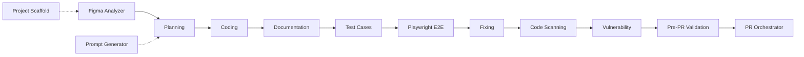

# `.cursornext/` — Next.js Vibe Engineering Agent System

This folder turns Cursor into an **agentic software factory** for a Next.js app. It is a set of 12 specialized agents, supporting rules, a skill, helper scripts, business-brief templates, and a structured logs system. Each agent does **one job, then stops** and hands off to the next — with a human approving every step.

> **TL;DR**
> - **New project?** Start at `@project-scaffold-agent` (or `@prompt-generator-agent` Mode B).
> - **New feature/module?** Go `@figma-analyzer` → `@planning-agent` → `@coding-agent` → `@documentation-agent` → `@testcases-agent` → `@e2e-testing-agent` → `@fixing-agent` → `@code-scanning-agent` → `@vulnerability-agent` → `@pre-pr-validation-agent` → `@pr-orchestrator-agent`.
> - Every agent **reads inputs from files, writes outputs to files** (mostly under `.cursornext/logs/` and `.cursornext/cache/`), then **stops**. Nothing auto-runs the next agent.
>
> 👉 E2E setup in a hurry? Read **[`docs/E2E-PLAYWRIGHT.md`](./docs/E2E-PLAYWRIGHT.md)** — Playwright config, specs, troubleshooting, and a new-project checklist.

---

## 1. Folder structure

```
.cursornext/
├── agents/            # The 12 agent definitions (the "who does what")
│   ├── agent-00-figma-analyzer.md
│   ├── agent-01-planning.md
│   ├── agent-02-coding.md
│   ├── agent-03-documentation.md
│   ├── agent-04-fixing.md
│   ├── agent-05-code-scanning.md
│   ├── agent-06-vulnerability.md
│   ├── agent-07-pr-orchestrator.md
│   ├── agent-08-project-scaffold.md
│   ├── agent-09-prompt-generator.md
│   ├── agent-10-testcases.md
│   ├── agent-11-e2e-testing.md
│   └── agent-12-pre-pr-validation.md
├── rules/             # Always-on / glob-scoped coding & workflow rules
│   ├── agent-workflow-rules.mdc       # Agent boundaries + full sequence
│   ├── figma-to-nextjs.mdc            # Figma → Next.js mapping rules
│   ├── nextjs.mdc                     # Next.js best practices (App Router)
│   ├── nextjs-best-practices.md
│   ├── coding-standards.md
│   └── e2e-testing.mdc                # Playwright E2E config/commands
├── scripts/           # Node helpers for Figma export (no extra deps)
│   ├── fetch-figma-nodes.js
│   ├── figma-get-nodes.js
│   ├── export-figma-svg.js
│   └── export-figma-png.js
├── skills/
│   └── nextjs-architecture/SKILL.md   # App structure, aliases, design system
├── docs/
│   └── E2E-PLAYWRIGHT.md              # Playwright E2E setup, config, troubleshooting
├── setup/
│   └── business-briefs/               # ~10-min YAML briefs → feature prompts
│       ├── README.md
│       ├── business-brief-template.yaml
│       └── business-brief-template-nextjs.yaml
├── cache/             # Agent inputs/intermediate artifacts (created on demand)
│   ├── figma-specs-{feature}.md
│   ├── figma-svgs/{feature}/...
│   ├── prompt-{feature}.md
│   └── prompt-project-create-{name}.md
└── logs/              # Agent outputs (the audit trail)
    ├── prd-{feature}-{timestamp}.md
    ├── coding/coding-{feature}.md
    ├── documentation/documentation-{feature}.md
    ├── test-cases-{feature}.md
    ├── fixing/fixing-{feature}.md
    ├── code-scanning/code-scanning-{feature}-{timestamp}.md
    ├── vulnerability/vulnerability-{date}.md
    ├── e2e-testing/{feature}/{timestamp}/...
    ├── project-scaffold/project-scaffold-{name}-{timestamp}.md
    ├── pre-pr/pre-pr-{branch-or-feature}-{timestamp}.md
    └── pr/pr-{feature}-{timestamp}.md
```

The repo also references a sibling `.cursor/` folder, which is the **same agent system for React Native** (Figma → RN, Detox instead of Playwright, etc.). This README documents the **Next.js** (`.cursornext/`) system.

---

## 2. Core principle: one agent, one task, one stop

Every agent follows the same contract (see `rules/agent-workflow-rules.mdc`):

- **Does** exactly one job.
- **Does not** do the next agent's job (e.g. Planning never writes code; Coding never creates a PRD).
- **Stops** when its output file is saved, and tells you the next agent to invoke.
- **Human approval** is required between every step. No agent auto-triggers another.

This gives you a reproducible, auditable pipeline: each stage leaves a file behind, so the next stage (and you) can see exactly what happened.

---

## 3. One-time setup

### 3.1 Figma access (for Agent 00 and scripts)

The project has **no Figma MCP**, so Figma extraction/export uses the **Figma REST API**, which needs a token.

1. Get a token: Figma → **Settings → Account → Personal access tokens**.
2. Copy `.env.example` → `.env.local` in the project root and add:
   ```
   FIGMA_ACCESS_TOKEN=your-token-here
   ```
3. **Never commit** the token. All scripts auto-load `.env.local` then `.env` (no `dotenv` dependency needed).

Without a token, Agent 00 still produces a spec but **lists assets instead of exporting them**, with a note to set the token and re-run.

### 3.2 Optional integrations

| Tool | Used by | How to enable |
|------|---------|---------------|
| **ESLint** | `@code-scanning-agent` | `create-next-app` adds ESLint; ensure a `lint` script in `package.json`. |
| **SonarQube** | `@code-scanning-agent` | Add `sonar-project.properties` + set `SONAR_HOST_URL`, `SONAR_TOKEN`. |
| **Snyk** | `@vulnerability-agent` | `npx snyk auth` or set `SNYK_TOKEN` in `.env.local`. |
| **Playwright** | `@fixing-agent` (test mode), `@e2e-testing-agent` | `playwright.config.ts`, `e2e/**/*.spec.ts`, `npm run e2e`. See `docs/E2E-PLAYWRIGHT.md`. |
| **Jest/Vitest + RTL** | `@testcases-agent`, `@fixing-agent` | Test config + `__tests__/*.test.tsx` (React Testing Library). |

---

## 4. The agents — what they do, inputs, outputs, and what happens when you run them

Invoke an agent by typing `@<agent-name>` in Cursor with the required info. Below, **"After running"** describes exactly what the agent produces and where it stops.

### Agent 08 — Project Scaffold (`@project-scaffold-agent`)
- **Input:** App name (e.g. `MyApp`); optional folder name.
- **Does:** Runs **`create-next-app`** (`npx create-next-app@latest <name> --ts --app --eslint --src-dir --import-alias "@/*" --use-npm --no-tailwind`) from the **parent of the workspace** (creates the project as a **sibling**, outside the current workspace). Then adds the `src/` folder structure + boilerplate (App Router layout/page, theme COLORS/TYPOGRAPHY/spacing, constants, store slice, sample route), and merges deps into `package.json`.
- **After running:** A new TypeScript Next.js project exists outside the workspace with boilerplate; log saved to `logs/project-scaffold/project-scaffold-{name}-{timestamp}.md`. **You** then run `npm install` and `npm run dev`.
- **Does not:** Recreate `package.json`/`next.config.js`/`tsconfig.json` from scratch, create feature code, or use Tailwind unless that's the project standard.

### Agent 09 — Prompt Generator (`@prompt-generator-agent`)
- **Two modes:**
  - **Mode A (feature prompt):** Reads a business brief YAML (+ optional Figma specs) and writes a ready-to-use prompt for the Planning Agent → `cache/prompt-{feature}.md`.
  - **Mode B (project prompt):** Writes a project-creation prompt that points you to `@project-scaffold-agent` → `cache/prompt-project-create-{name}.md`.
- **After running:** A prompt file is saved; the agent tells you to feed it to `@planning-agent` (A) or `@project-scaffold-agent` (B).
- **Does not:** Create a PRD, write code, run CLI, or run Figma.

### Agent 00 — Figma Analyzer (`@figma-analyzer`)
- **Input (4 required):** Feature name (kebab-case), Figma URL (with `node-id`), Frame name, Section description.
- **Does:** Extracts the **frame** (hierarchy, measurements, colors, typography **incl. fontWeight**, spacing, responsive notes) and maps to web tokens (COLORS, TYPOGRAPHY, styled-components/CSS). **Automatically** exports every icon (SVG) and image (PNG) found in the frame: SVGs → `cache/figma-svgs/{feature}/` (then into `src/assets/icons`), raster → `public/images/`.
- **After running:** Spec saved to `cache/figma-specs-{feature}.md`; assets exported (or listed with a "set FIGMA_ACCESS_TOKEN" note). Stops; hand off to Planning or Coding.
- **Does not:** Create a PRD or write code.

### Agent 01 — Planning (`@planning-agent`)
- **Input:** A prompt (`cache/prompt-{feature}.md`), Figma specs (`cache/figma-specs-{feature}.md`), a Figma URL, or a written description.
- **Does:** Loads the Next.js architecture skill + rules, then writes a full **PRD** (overview, functional/technical requirements, Next.js implementation incl. **server vs client component boundaries**, routing, data fetching, design specs, validation, testing, acceptance).
- **After running:** PRD saved to `logs/prd-{feature}-{timestamp}.md`. Stops; hand off to `@coding-agent`.
- **Does not:** Write code or run tests.

### Agent 02 — Coding (`@coding-agent`)
- **Input:** Approved PRD path (+ optional Figma specs).
- **Does:** Reads the PRD, **creates the coding log before writing code**, loads the architecture skill + rules, then implements files under `src/` (App Router routes/layouts, Server/Client Components, styled-components in `styles.ts`, design tokens — no raw hex/fonts, TITLES/ALERTS/ROUTES constants, services/api layer, typed Redux). Runs lint/type checks.
- **After running:** Source files created/modified; coding log saved/updated at `logs/coding/coding-{feature}.md` with validation results. Stops; hand off to `@documentation-agent` or `@fixing-agent`.
- **Does not:** Create a PRD or run E2E.

### Agent 03 — Documentation (`@documentation-agent`)
- **Input:** Files to document (explicit list, or from the coding log).
- **Does:** Adds JSDoc, file headers, and inline comments **without changing any logic or styles**.
- **After running:** Files updated with docs; optional doc log at `logs/documentation/documentation-{feature}.md`. Stops.
- **Does not:** Fix bugs, refactor, or change behavior.

### Agent 10 — Test Case Authoring (`@testcases-agent`)
- **Input:** Feature name + PRD path + coding log path (optional Figma specs).
- **Does:** Writes a **manual QA test-case doc** (`logs/test-cases-{feature}.md`, TC-IDs with priority/steps/expected/selectors) and, by default, a **component test file** (`__tests__/{Feature}.test.tsx`, React Testing Library) mapping `it('TC-001: …')` to each case.
- **After running:** Test-cases file (+ test file) created; tells you `@fixing-agent` can now run "Test {feature}". Stops.
- **Does not:** Run Playwright E2E or fix code.

### Agent 11 — Playwright E2E Testing (`@e2e-testing-agent`)
- **Input:** Feature name (or "entire app") + **base URL** (default `http://localhost:3000`).
- **Setup:** Full Playwright setup (config, specs, troubleshooting, new-project checklist) is in **`docs/E2E-PLAYWRIGHT.md`**. The agent verifies setup (STEP 0) before running and stops if a piece is missing.
- **Does:** Creates `e2e/{feature}.spec.ts` if missing (flow-based journeys with accessible locators / `data-testid`), ensures the app is reachable (or `webServer` starts it), **runs Playwright automatically**, captures screenshots/videos/traces, and writes a results file with issues + **recommendations only** (root cause, file/line, before/after code).
- **After running:** Results at `logs/e2e-testing/{feature}/{timestamp}/test-results.md` (+ `screenshots/`, `videos/`, `traces/`). Stops; hand off to `@fixing-agent` for fixes.
- **Does not:** Modify source code.

### Agent 04 — Fixing (`@fixing-agent`)
- **Two modes:**
  - **Fix-only:** "Fix X" → reads coding log + code, applies **simple** fixes (typos, optional chaining, style tokens, import/alias, missing `data-testid`/a11y, server/client boundary, route constants).
  - **Test-and-fix:** "Test {feature}" + base URL → requires `logs/test-cases-{feature}.md`, runs **component tests** (and **Playwright** if configured), tracks pass/fail by TC-ID and priority, fixes simple failures, re-runs.
- **After running:** Fixes applied; fixing log saved/updated at `logs/fixing/fixing-{feature}.md` with results by TC-ID. Complex issues documented as "Requires Coding Agent". Stops.
- **Does not:** Create a PRD, implement new features, or run without a test-cases file in test mode.

### Agent 05 — Code Scanning (`@code-scanning-agent`)
- **Input:** Feature name or file scope.
- **Does:** Runs a Next.js quality checklist (structure, design system, aliases, styling, server/client boundaries, data fetching, state, a11y, performance, compliance), runs **ESLint** (and **SonarQube** if configured), scores and prioritizes (P1/P2/P3).
- **After running:** Report saved to `logs/code-scanning/code-scanning-{feature}-{timestamp}.md` + summary in chat. Stops. **Does not fix code.**

### Agent 06 — Vulnerability (`@vulnerability-agent`)
- **Input:** Project root (default) or feature context.
- **Does:** Runs `npm audit` (and **Snyk** if configured), categorizes by severity → P1–P4 with remediation.
- **After running:** Report saved to `logs/vulnerability/vulnerability-{date}.md` + chat summary. Stops. **Does not apply fixes.**

### Agent 12 — Pre-PR Validation (`@pre-pr-validation-agent`)
- **Input:** Current branch / working tree; optional base branch (default `main`), feature name, or file scope.
- **Does:** Reviews **only the changed files** (`git diff` vs base) plus related dependents for context. Validates seven areas — code quality & best practices, folder-structure compliance, React/Next.js performance, security & insecure patterns, TypeScript/lint/test (scoped), PR readiness, and potential **breaking changes** — then runs scoped ESLint/type check/tests and produces P1/P2/P3 findings with a **READY / NOT READY** verdict.
- **After running:** Report saved to `logs/pre-pr/pre-pr-{branch-or-feature}-{timestamp}.md` + chat summary. Stops. **Recommendations only — does not modify code.** Hand off fixes to `@fixing-agent` / `@coding-agent`, then run `@pr-orchestrator-agent`.
- **Does not:** Fix/refactor code, review the whole codebase, or create/commit/submit/merge a PR.

### Agent 07 — PR Orchestrator (`@pr-orchestrator-agent`)
- **Input:** Feature name (gathers PRD, coding log, fixing log, scans automatically).
- **Does:** Generates a PR document (overview, changes, testing, quality/security summary).
- **After running:** PR doc saved to `logs/pr/pr-{feature}-{timestamp}.md`. Stops. **Does not submit or merge the PR.**
- **Tip:** Run `@pre-pr-validation-agent` first to confirm the changes are READY, then use this agent to write the PR document.

---

## 5. Sequences

### 5.1 Sequence for a brand-new project

```
(optional) @prompt-generator-agent  (Mode B)   →  cache/prompt-project-create-{name}.md
@project-scaffold-agent  "Create project MyApp" →  ../MyApp/ (sibling) + boilerplate + scaffold log
        ↓  (you run)
npm install   &&   npm run dev
        ↓
proceed to the per-feature sequence below for each route/module
```

### 5.2 Sequence for a new module / feature

```
1.  @figma-analyzer          → cache/figma-specs-{feature}.md  (+ exported SVG/PNG assets)
1b. (fill business brief)    → setup/business-briefs/business-brief-{feature}.yaml
1c. @prompt-generator-agent  → cache/prompt-{feature}.md           (optional, Mode A)
2.  @planning-agent          → logs/prd-{feature}-{timestamp}.md
3.  @coding-agent            → src/... + logs/coding/coding-{feature}.md
4.  @documentation-agent     → JSDoc/comments + (optional) doc log
5.  @testcases-agent         → logs/test-cases-{feature}.md + __tests__/{Feature}.test.tsx   (optional)
6.  @e2e-testing-agent       → logs/e2e-testing/{feature}/{timestamp}/test-results.md          (optional)
7.  @fixing-agent            → fixes + logs/fixing/fixing-{feature}.md
8.  @code-scanning-agent     → logs/code-scanning/code-scanning-{feature}-{timestamp}.md
9.  @vulnerability-agent     → logs/vulnerability/vulnerability-{date}.md
10. @pre-pr-validation-agent → logs/pre-pr/pre-pr-{branch-or-feature}-{timestamp}.md   (before raising the PR)
11. @pr-orchestrator-agent   → logs/pr/pr-{feature}-{timestamp}.md
```

Each step is **manually invoked** and **stops** when done. Skip optional steps (1b/1c, 5, 6) if you don't need them. The minimum viable path for a designed feature is: **Figma → Planning → Coding → Fixing**.



---

## 6. Quick invocation reference

| Agent | Invoke | Provide | Output |
|-------|--------|---------|--------|
| 08 Scaffold | `@project-scaffold-agent` | App name (+ optional folder) | New Next.js project (sibling) + scaffold log |
| 09 Prompt Gen | `@prompt-generator-agent` | Feature+brief (A) or project name (B) | `cache/prompt-*.md` |
| 00 Figma | `@figma-analyzer` | Feature, URL+node-id, Frame, Section | `cache/figma-specs-{feature}.md` + assets |
| 01 Planning | `@planning-agent` | Prompt/specs path or description | `logs/prd-{feature}-{ts}.md` |
| 02 Coding | `@coding-agent` | PRD path | `src/...` + `logs/coding/coding-{feature}.md` |
| 03 Docs | `@documentation-agent` | Files or coding log | Documented files + doc log |
| 10 Test Cases | `@testcases-agent` | Feature + PRD + coding log | `logs/test-cases-{feature}.md` + test file |
| 11 E2E | `@e2e-testing-agent` | Feature + base URL | `logs/e2e-testing/.../test-results.md` |
| 04 Fixing | `@fixing-agent` | "Fix X" or "Test {feature}" + base URL | `logs/fixing/fixing-{feature}.md` |
| 05 Scan | `@code-scanning-agent` | Feature or scope | `logs/code-scanning/...md` |
| 06 Vuln | `@vulnerability-agent` | (project root) | `logs/vulnerability/vulnerability-{date}.md` |
| 12 Pre-PR | `@pre-pr-validation-agent` | (optional base branch) | `logs/pre-pr/pre-pr-{branch-or-feature}-{ts}.md` + verdict |
| 07 PR | `@pr-orchestrator-agent` | Feature | `logs/pr/pr-{feature}-{ts}.md` |

**Example invocations (per agent)**

```
@project-scaffold-agent
Create project MyApp
```

```
@prompt-generator-agent
Mode A: Generate a Planning prompt for feature forgot-password
from setup/business-briefs/business-brief-forgot-password.yaml
and cache/figma-specs-forgot-password.md
```

```
@figma-analyzer
Feature name: forgot-password
URL: https://www.figma.com/design/ABC123/App?node-id=10-8700
Frame: Forgot_Password
Section: Forgot password page – layout, fields, buttons, copy, icons
```

```
@planning-agent
Plan feature: forgot-password from .cursornext/cache/figma-specs-forgot-password.md
```

```
@coding-agent
Implement PRD from .cursornext/logs/prd-forgot-password-20260202-143000.md
```

```
@documentation-agent
Document the files from .cursornext/logs/coding/coding-forgot-password.md
```

```
@testcases-agent
Author test cases for forgot-password
PRD: .cursornext/logs/prd-forgot-password-20260202-143000.md
Coding log: .cursornext/logs/coding/coding-forgot-password.md
```

```
@e2e-testing-agent
Run E2E for forgot-password
Base URL: http://localhost:3000
```

```
@fixing-agent
Test forgot-password.
Base URL: http://localhost:3000
```

```
@code-scanning-agent
Scan quality for forgot-password
```

```
@vulnerability-agent
Scan dependencies for vulnerabilities
```

```
@pre-pr-validation-agent
Validate my changes before raising a PR (base: main).
```

```
@pr-orchestrator-agent
Create the PR document for forgot-password
```

**End-to-end worked example — adding a `forgot-password` page**

This is the full happy path from a Figma design to a PR document. Each line is a **separate** prompt you send; you review the saved file before moving on.

```
1) @figma-analyzer
   Feature name: forgot-password
   URL: https://www.figma.com/design/ABC123/App?node-id=10-8700
   Frame: Forgot_Password
   Section: Forgot password page – layout, fields, buttons, copy, icons
   → writes  cache/figma-specs-forgot-password.md  (+ exported SVG/PNG assets)

2) @planning-agent
   Plan feature: forgot-password from .cursornext/cache/figma-specs-forgot-password.md
   → writes  logs/prd-forgot-password-20260202-143000.md

3) @coding-agent
   Implement PRD from .cursornext/logs/prd-forgot-password-20260202-143000.md
   → writes  src/app/forgot-password/... + logs/coding/coding-forgot-password.md

4) @documentation-agent
   Document the files from .cursornext/logs/coding/coding-forgot-password.md
   → adds JSDoc/comments (no logic changes)

5) @testcases-agent
   Author test cases for forgot-password (PRD + coding log paths)
   → writes  logs/test-cases-forgot-password.md + __tests__/ForgotPassword.test.tsx

6) @fixing-agent
   Test forgot-password.   Base URL: http://localhost:3000
   → runs tests, fixes simple failures, writes logs/fixing/fixing-forgot-password.md

7) @code-scanning-agent     →  logs/code-scanning/code-scanning-forgot-password-<ts>.md
8) @vulnerability-agent     →  logs/vulnerability/vulnerability-<date>.md

9) @pre-pr-validation-agent
   Validate my changes before raising a PR (base: main).
   → writes  logs/pre-pr/pre-pr-forgot-password-<ts>.md  (READY / NOT READY)
   → if NOT READY: hand fixes back to @fixing-agent / @coding-agent, then re-run step 9

10) @pr-orchestrator-agent
    Create the PR document for forgot-password
    → writes  logs/pr/pr-forgot-password-<ts>.md
```

> **Minimum viable path** for an already-designed feature: `@figma-analyzer` → `@planning-agent` → `@coding-agent` → `@fixing-agent`. Steps 4, 5, 7, 8 are optional polish/quality gates.

---

## 7. Rules, skill, scripts, and setup

### Rules (`rules/`)
- **`agent-workflow-rules.mdc`** — Defines each agent's boundaries and the full workflow sequence (always applied).
- **`figma-to-nextjs.mdc`** — Mapping rules: Figma frame → layout/page, auto-layout → flex/grid/gap, colors → COLORS, text → TYPOGRAPHY (with mandatory fontWeight), effects → box-shadow.
- **`nextjs.mdc` / `nextjs-best-practices.md`** — App Router structure, Server vs Client Components, data fetching, styled-components co-location, performance (`next/image`, dynamic import, caching), a11y (glob-scoped to TS/TSX files).
- **`coding-standards.md`** — Naming, import order, DRY, optional chaining, project structure conventions.
- **`e2e-testing.mdc`** — Playwright config (`playwright.config.ts`), spec location (`e2e/**/*.spec.ts`), and commands used by the testing agents. Full setup: `docs/E2E-PLAYWRIGHT.md`.

> Note: these `.cursornext/rules/` files are the **shared knowledge base** the agents read. The repo-level user rules (folder structure, styled-components, i18n, optional chaining, no-comments, etc.) also apply to all generated code.

### Skill (`skills/nextjs-architecture/SKILL.md`)
The canonical reference for **app structure** (`src/app` App Router), **path aliases** (`@/*`), and the **design system** (COLORS, TYPOGRAPHY, spacing, commonStyles). Planning, Coding, Scaffold, and Prompt agents all load this first.

### Docs (`docs/`)
- **`E2E-PLAYWRIGHT.md`** — Playwright E2E setup (install, `playwright.config.ts`, specs, selectors/test ids, artifacts, commands, troubleshooting, and a new-project checklist). Referenced by the E2E, Fixing, and Test Case agents.

### Scripts (`scripts/`) — run from project root, auto-load `.env.local` then `.env`
| Script | Purpose | Example |
|--------|---------|---------|
| `fetch-figma-nodes.js` | Save a node's full document JSON to cache | `node .cursornext/scripts/fetch-figma-nodes.js <fileKey> <nodeId> [outfile]` |
| `figma-get-nodes.js` | Fetch node(s) → `cache/figma-node-{name}.json` | `node .cursornext/scripts/figma-get-nodes.js <nodeId> [fileKey] [name]` |
| `export-figma-svg.js` | Export a node as SVG → `cache/figma-svgs/{feature}/` (then into `src/assets/icons`) | `node .cursornext/scripts/export-figma-svg.js <feature> <nodeId> [fileKey] [outFile]` |
| `export-figma-png.js` | Export raster → `public/images/` (for `next/image`) | `node .cursornext/scripts/export-figma-png.js <nodeId> <output-name> <fileKey> [scale]` |

All scripts require `FIGMA_ACCESS_TOKEN` (or `FIGMA_TOKEN`) in `.env.local` or the environment.

### Setup (`setup/business-briefs/`)
A ~10-minute YAML brief that captures business context (purpose, rules, customization, success metrics). Copy `business-brief-template-nextjs.yaml` → `business-brief-{feature}.yaml`, fill it, then feed it to `@prompt-generator-agent` (Mode A) to generate a Planning prompt. See that folder's `README.md` for the flow.

---

## 8. Outputs map (where to look after each agent)

| You ran… | Look here |
|----------|-----------|
| Figma Analyzer | `cache/figma-specs-{feature}.md`, `cache/figma-svgs/{feature}/`, `public/images/` |
| Prompt Generator | `cache/prompt-{feature}.md` or `cache/prompt-project-create-{name}.md` |
| Planning | `logs/prd-{feature}-{timestamp}.md` |
| Coding | `src/...` + `logs/coding/coding-{feature}.md` |
| Documentation | updated source files + `logs/documentation/documentation-{feature}.md` |
| Test Cases | `logs/test-cases-{feature}.md` + `__tests__/{Feature}.test.tsx` |
| Playwright E2E | `logs/e2e-testing/{feature}/{timestamp}/test-results.md` (+ screenshots/videos/traces) |
| Fixing | `logs/fixing/fixing-{feature}.md` |
| Code Scanning | `logs/code-scanning/code-scanning-{feature}-{timestamp}.md` |
| Vulnerability | `logs/vulnerability/vulnerability-{date}.md` |
| Pre-PR Validation | `logs/pre-pr/pre-pr-{branch-or-feature}-{timestamp}.md` (READY / NOT READY verdict) |
| PR Orchestrator | `logs/pr/pr-{feature}-{timestamp}.md` |
| Project Scaffold | new sibling project + `logs/project-scaffold/project-scaffold-{name}-{timestamp}.md` |

---

## 9. FAQ

- **Do agents run automatically one after another?** No. You invoke each one and approve its output. Agents only *suggest* the next step.
- **What if an input file is missing?** Agents stop and tell you exactly what's needed (e.g. Coding stops if no PRD; Fixing-test stops if no test-cases file or base URL).
- **Where do agents save things?** Inputs/intermediate → `.cursornext/cache/`; outputs/audit trail → `.cursornext/logs/`; generated app code → `src/`, `__tests__/`, `e2e/`, `public/images/`.
- **Can I skip steps?** Yes. Optional steps are 1b/1c (brief/prompt), 5 (test cases), 6 (Playwright E2E). Minimum designed-feature path: Figma → Planning → Coding → Fixing.
- **What about React Native?** The sibling `.cursor/` folder mirrors this system for React Native (Figma → RN rules, Detox instead of Playwright).
```
