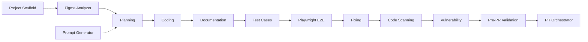

# `.cursornext/` — Next.js Vibe Engineering Agent System

This folder turns Cursor into an **agentic software factory** for a Next.js app. It is a set of 22 agents (00–21, incl. Ponytail), supporting rules, a skill, helper scripts, form/E2E/example/monorepo/fetch/error-pages/socket setup templates, business-brief templates, and a structured logs system. Each agent does **one job, then stops** and hands off to the next — with a human approving every step.

> **TL;DR**
> - **New single app?** `@project-scaffold-agent` (or `@prompt-generator-agent` Mode B). **Monorepo?** `@monorepo-scaffold-agent`.
> - **Forms?** `@useform-builder-agent` (schema-based `useForm` hook; no Formik/yup).
> - **HTTP / API?** **Dependency-free fetch client** (`src/lib/fetch-client.ts`, axios-free). Scaffold installs it; use `@fetch-client-agent` to wire interceptors or migrate off axios.
> - **New feature/module?** `@figma-analyzer` → `@planning-agent` → `@coding-agent` → `@documentation-agent` → `@testcases-agent` → `@e2e-testing-agent` → `@fixing-agent` → `@code-scanning-agent` → `@vulnerability-agent` → `@pre-pr-validation-agent` → `@pr-orchestrator-agent`.
> - Every agent **reads inputs from files, writes outputs to files** (mostly under `.cursornext/logs/` and `.cursornext/cache/`), then **stops**. Nothing auto-runs the next agent.
>
> 👉 E2E setup: **[`docs/E2E-PLAYWRIGHT.md`](./docs/E2E-PLAYWRIGHT.md)**. React Native kit: **[`.cursor/README.md`](../.cursor/README.md)**. Side-by-side overview: **[root `README.md`](../README.md)**.

---

## Table of contents

1. [Folder structure](#1-folder-structure)
2. [Core principle](#2-core-principle-one-agent-one-task-one-stop)
3. [One-time setup](#3-one-time-setup)
4. [Agents (detailed)](#4-agents--what-they-do)
5. [Workflows](#5-workflows)
6. [Agent reference](#6-agent-reference)
7. [Worked example](#7-worked-example--forgot-password)
8. [Rules, skill, scripts & setup](#8-rules-skill-scripts--setup)
9. [Outputs map](#9-outputs-map)
10. [FAQ](#10-faq)

---

## 1. Folder structure

```
.cursornext/
├── agents/            # Agent definitions 00–21
│   ├── agent-00-figma-analyzer.md
│   ├── agent-01-planning.md
│   ├── agent-02-coding.md
│   ├── agent-03-documentation.md
│   ├── agent-04-fixing.md
│   ├── agent-05-code-scanning.md
│   ├── agent-06-vulnerability.md
│   ├── agent-07-pr-orchestrator.md
│   ├── agent-08-project-scaffold.md
│   ├── agent-09-prompt-generator.md
│   ├── agent-10-testcases.md
│   ├── agent-11-e2e-testing.md
│   ├── agent-12-pre-pr-validation.md
│   ├── agent-13-useform-builder.md
│   ├── agent-14-monorepo-scaffold.md
│   ├── agent-15-fetch-client.md
│   ├── agent-16-user-story-testcases.md
│   ├── agent-17-unit-test-analysis.md
│   ├── agent-18-npm-audit-auto-fix.md
│   ├── agent-19-error-pages.md
│   ├── agent-20-socket-setup.md
│   └── agent-21-ponytail.md
├── rules/
├── scripts/
├── hooks/             # npm-audit-after-install.js (auto hook)
├── skills/nextjs-architecture/SKILL.md
├── docs/E2E-PLAYWRIGHT.md
├── setup/             # business-briefs, hooks, constants, e2e, example-module, lib, error-pages, socket, monorepo
├── cache/
└── logs/
```

The sibling [`.cursor/`](../.cursor/) folder is the **same agent system for React Native** (Detox instead of Playwright, keyboard layout agent, etc.). This README documents **Next.js** only.

---

## 2. Core principle: one agent, one task, one stop

Every agent follows the same contract (see `rules/agent-workflow-rules.mdc`):

- **Does** exactly one job.
- **Does not** do the next agent's job (e.g. Planning never writes code; Coding never creates a PRD).
- **Stops** when its output file is saved, and tells you the next agent to invoke.
- **Human approval** is required between every step. No agent auto-triggers another.

---

## 3. One-time setup

### 3.1 Figma access (for Agent 00 and scripts)

1. Get a token: Figma → **Settings → Account → Personal access tokens**.
2. Create **`.env`** in the project root and add:
   ```
   FIGMA_ACCESS_TOKEN=your-token-here
   NEXT_PUBLIC_API_BASE_URL=
   ```
3. **Never commit** `.env`. All scripts auto-load `.env` only.

Without a token, Agent 00 still produces a spec but **lists assets instead of exporting them**.

### 3.2 Optional integrations

| Tool | Used by | How to enable |
|------|---------|---------------|
| **ESLint** | `@code-scanning-agent` | `create-next-app` adds ESLint; ensure a `lint` script in `package.json`. |
| **SonarQube** | `@code-scanning-agent` | Add `sonar-project.properties` + set `SONAR_HOST_URL`, `SONAR_TOKEN`. |
| **Snyk** | `@vulnerability-agent` | `npx snyk auth` or set `SNYK_TOKEN` in `.env`. |
| **Playwright** | `@fixing-agent` (test mode), `@e2e-testing-agent` | `playwright.config.ts`, `e2e/**/*.spec.ts`, `npm run e2e`. See `docs/E2E-PLAYWRIGHT.md`. |
| **Jest/Vitest + RTL** | `@testcases-agent`, `@fixing-agent` | Test config + `__tests__/*.test.tsx`. |

---

## 4. Agents — what they do

### Agent 00 — Figma Analyzer (`@figma-analyzer`)
- **Input (4 required):** Feature name (kebab-case), Figma URL (with `node-id`), Frame name, Section description.
- **Does:** Extracts the **frame** (hierarchy, measurements, colors, typography **incl. fontWeight**, spacing, responsive notes) and maps to web tokens (COLORS, TYPOGRAPHY, styled-components/CSS). Exports icons (SVG) and images (PNG): SVGs → `cache/figma-svgs/{feature}/` → `src/assets/icons`; raster → `public/images/`.
- **After running:** Spec at `cache/figma-specs-{feature}.md`; assets exported or listed. Stops; hand off to Planning or Coding.
- **Does not:** Create a PRD or write code.

### Agent 01 — Planning (`@planning-agent`)
- **Input:** Prompt (`cache/prompt-{feature}.md`), Figma specs, Figma URL, or written description.
- **Does:** Loads Next.js architecture skill + rules; writes full **PRD** (overview, requirements, Next.js implementation incl. **server vs client component boundaries**, routing, data fetching, design specs, validation, testing, acceptance).
- **After running:** PRD at `logs/prd-{feature}-{timestamp}.md`. Stops; hand off to `@coding-agent`.
- **Does not:** Write code or run tests.

### Agent 02 — Coding (`@coding-agent`)
- **Input:** Approved PRD path (+ optional Figma specs).
- **Does:** Creates coding log first, loads architecture skill + rules, implements under `src/` (App Router routes/layouts, Server/Client Components, styled-components in `styles.ts`, design tokens, TITLES/ALERTS/ROUTES constants, services/api layer, typed Redux). Runs lint/type checks.
- **After running:** Source + coding log at `logs/coding/coding-{feature}.md`. Stops; hand off to `@documentation-agent` or `@fixing-agent`.
- **Does not:** Create a PRD or run E2E.

### Agent 03 — Documentation (`@documentation-agent`)
- **Input:** Files to document (explicit list, or from coding log).
- **Does:** JSDoc, file headers, inline comments **without changing logic or styles**.
- **After running:** Documented files; optional doc log at `logs/documentation/documentation-{feature}.md`. Stops.
- **Does not:** Fix bugs, refactor, or change behavior.

### Agent 04 — Fixing (`@fixing-agent`)
- **Two modes:**
  - **Fix-only:** "Fix X" → simple fixes (typos, optional chaining, style tokens, import/alias, missing `data-testid`/a11y, server/client boundary, route constants).
  - **Test-and-fix:** "Test {feature}" + base URL → requires `logs/test-cases-{feature}.md`, runs component tests (+ Playwright if configured), fixes simple failures by TC-ID.
- **After running:** Fixing log at `logs/fixing/fixing-{feature}.md`. Complex issues → "Requires Coding Agent". Stops.
- **Does not:** Create a PRD, implement new features, or run test mode without test-cases file.

### Agent 05 — Code Scanning (`@code-scanning-agent`)
- **Input:** Feature name or file scope.
- **Does:** Next.js quality checklist (structure, design system, aliases, styling, server/client boundaries, data fetching, state, a11y, performance, compliance), **ESLint** (+ SonarQube if configured), P1/P2/P3 scoring.
- **After running:** Report at `logs/code-scanning/code-scanning-{feature}-{timestamp}.md`. Stops. **Does not fix code.**

### Agent 06 — Vulnerability (`@vulnerability-agent`)
- **Input:** Project root (default) or feature context.
- **Does:** `npm audit` (+ Snyk if configured), severity → P1–P4 remediation.
- **After running:** Report at `logs/vulnerability/vulnerability-{date}.md`. Stops. **Does not apply fixes.**

### Agent 07 — PR Orchestrator (`@pr-orchestrator-agent`)
- **Input:** Feature name (gathers PRD, coding log, fixing log, scans).
- **Does:** PR document (overview, changes, testing, quality/security summary).
- **After running:** PR doc at `logs/pr/pr-{feature}-{timestamp}.md`. Stops. **Does not submit or merge.**
- **Tip:** Run `@pre-pr-validation-agent` first.

### Agent 08 — Project Scaffold (`@project-scaffold-agent`)
- **Input:** App name; optional folder name.
- **Does:** Runs **`create-next-app`** from parent of workspace (sibling project). Adds `src/` boilerplate, merges deps, installs **fetch client** via `pnpm setup:fetch` (**no axios**). Chains fetch, useForm, error pages (19).
- **After running:** New Next.js project outside workspace; log at `logs/project-scaffold/project-scaffold-{name}-{timestamp}.md`. **You** run `npm install` and `npm run dev`.
- **Does not:** Recreate config from scratch, use Tailwind unless project standard, or create a monorepo (use Agent 14).

### Agent 09 — Prompt Generator (`@prompt-generator-agent`)
- **Mode A:** Business brief YAML (+ optional Figma specs) → `cache/prompt-{feature}.md`.
- **Mode B:** Project-creation prompt → `cache/prompt-project-create-{name}.md`.
- **Does not:** Create PRD, write code, run CLI, or run Figma.

### Agent 10 — Test Case Authoring (`@testcases-agent`)
- **Input:** Feature + PRD + coding log (optional Figma specs).
- **Does:** Manual QA doc (`logs/test-cases-{feature}.md`) + default `__tests__/{Feature}.test.tsx` (RTL) mapping TC-IDs.
- **After running:** Test-cases + test file; `@fixing-agent` can run "Test {feature}". Stops.
- **Does not:** Run Playwright E2E or fix code.

### Agent 11 — Playwright E2E (`@e2e-testing-agent`)
- **Input:** Feature (or "entire app") + **base URL** (default `http://localhost:3000`).
- **Setup:** [`docs/E2E-PLAYWRIGHT.md`](./docs/E2E-PLAYWRIGHT.md). Agent verifies setup (STEP 0) before running.
- **Does:** Creates `e2e/{feature}.spec.ts` if missing, ensures app reachable (or `webServer` starts it), **runs Playwright**, captures screenshots/videos/traces, writes results with recommendations only.
- **After running:** Results at `logs/e2e-testing/{feature}/{timestamp}/test-results.md`. Stops; hand off to `@fixing-agent`.
- **Does not:** Modify source code.

### Agent 12 — Pre-PR Validation (`@pre-pr-validation-agent`)
- **Input:** Current branch; optional base (default `main`), feature name, or scope.
- **Does:** Reviews **only changed files** + dependents. Validates seven areas — code quality, folder structure, Next.js performance, security, TypeScript/lint/test (scoped), PR readiness, breaking changes — then scoped checks and **READY / NOT READY**.
- **After running:** Report at `logs/pre-pr/pre-pr-{branch-or-feature}-{timestamp}.md`. **Recommendations only.** Stops.
- **Does not:** Fix code or create/submit/merge PR.

### Agent 13 — useForm Builder (`@useform-builder-agent`)
- **Input:** Form name + fields + target component path.
- **Does:** Schema-based **`useForm`** — `initialState` schema, dirty-gated errors, i18n errors, validators in `constants/form-validators`, service-layer submit. Runs `pnpm setup:useform` if hook missing.
- **After running:** Form (`index.tsx` + `styles.ts`) + coding log. Stops.
- **Does not:** Create PRD, run E2E, or add Formik/react-hook-form/yup.

### Agent 14 — Monorepo Scaffold (`@monorepo-scaffold-agent`)
- **Input:** Monorepo name; optional apps (default `web`), packages (default `ui`, `lib-utils`), `USE_TURBO`.
- **Does:** Creates **pnpm workspace monorepo** as sibling via `setup-monorepo.js`: root `package.json` + `pnpm-workspace.yaml`, `apps/*` (each via `create-next-app`), `packages/ui` + `packages/lib-utils`, copies kit as `.cursor/`, installs useForm + fetch client in `packages/lib-utils`, example module in primary app, `pnpm install`. No Turborepo unless `USE_TURBO=true`.
- **After running:** Log at `logs/monorepo-scaffold/monorepo-{name}-{timestamp}.md`. **You** run `pnpm dev`.
- **Does not:** Build features, deploy, or create a single app (use Agent 08).

### Agent 15 — Fetch Client (`@fetch-client-agent`)
- **Input:** Optional `FETCH_TARGET=packages/lib-utils` for monorepos; optional interceptors; optional axios migration.
- **Does:** Installs `src/lib/fetch-client.ts` via `pnpm setup:fetch`; configures `NEXT_PUBLIC_API_BASE_URL` + interceptors; converts axios → `uploadFile`; removes axios where unused.
- **After running:** Fetch client wired; coding log at `logs/coding/coding-fetch-client.md`. Stops.
- **Does not:** Create PRD, implement features, or add third-party HTTP library.

### Agent 16 — User Story Test Cases (`@user-story-testcases-agent`)
- **Input:** Feature + user story text; optional acceptance criteria, PRD/coding log.
- **Does:** Manual QA test cases from user story alone → `logs/test-cases-{feature}.md` with TC-IDs, flows, `data-testid` selectors, Jest/Playwright hints.
- **After running:** Test-cases file; hand off to coding/testcases/fixing/e2e agents. Stops.
- **Does not:** Write feature code, run tests, or create Jest/Playwright files.

### Agent 17 — Unit Test Analysis (`@unit-test-analysis-agent`)
- **Input:** Target page/component; optional scope (`analysis only` | `analysis + tests` | `analysis + tests + run`).
- **Does:** Code-driven analysis, coverage matrix, bug detection, Jest + RTL tests. Report at `logs/unit-test-analysis/unit-test-analysis-{feature}-{timestamp}.md`.
- **After running:** Report (+ Jest file unless opted out); hand off to `@fixing-agent` for BUG-IDs. Stops.
- **Does not:** Fix production code or run Playwright E2E.

### Agent 18 — npm Audit Auto-Fix (`@npm-audit-auto-fix-agent`)
- **Input:** Project root. Also runs automatically after `npm install` / `npm ci` via hook.
- **Does:** Auto-fixes npm vulnerabilities via `npm-audit-auto-fix.js`.
- **After running:** Report at `logs/vulnerability/npm-audit-auto-fix-{timestamp}.md`. Stops.
- **Does not:** Replace Agent 06 documentation-only scans.

### Agent 19 — Error Pages (`@error-pages-agent`)
- **Input:** Project root; optional `ERROR_PAGES_TARGET=apps/web` for monorepos.
- **Does:** Connection Lost + Unauthorized + `NetworkGate` + `AppShell` + `/unauthorized` + browser `useNetworkStatus` + `handleUnauthorized` via `setup-error-pages.js`. Chained by Agents 08 and 14.
- **After running:** Coding log at `logs/coding/coding-error-pages.md`. Stops.
- **Does not:** Implement auth/login; run `npm run dev`.

### Agent 20 — Socket Setup (`@socket-agent`)
- **Input:** Interactive intake — mode (configure-only | existing-module | new-module), module name, design source, optional WebSocket URL; optional `SOCKET_TARGET=apps/web`.
- **Does:** AskQuestion unless pre-filled. WebSocket client, `useSocket`, service, constants via `setup-socket.js`. Optionally scaffolds feature hook, service, App Router page, route. Intake → `cache/socket-intake-{module}.md`.
- **After running:** Socket infra + coding log at `logs/coding/coding-socket-{module}.md`. Stops.
- **Does not:** Create PRD; build full UI without design; run `npm run dev`.

### Agent 21 — Ponytail (always-on)
- **Trigger:** `alwaysApply: true` — no `@` invocation.
- **Does:** Minimal diff, reuse, YAGNI on every chat.
- **Does not:** Skip security, a11y, or explicit user requests.

---

## 5. Workflows

### 5.1 Brand-new project

**Single app:**

```
(optional) @prompt-generator-agent  (Mode B)   →  cache/prompt-project-create-{name}.md
@project-scaffold-agent  "Create project MyApp" →  ../MyApp/ (sibling) + boilerplate + scaffold log
        ↓  (you run)
npm install   &&   npm run dev
        ↓
proceed to per-feature sequence below
```

**Monorepo:**

```
@monorepo-scaffold-agent  "Create monorepo AcmePlatform with apps web and admin"
   → ../acme-platform/ (sibling): apps/* + packages/ui + packages/lib-utils,
     kit copied as .cursor/, useForm in lib-utils, example module in primary app
        ↓  (you run)
cd ../acme-platform   &&   pnpm dev
```

### 5.2 New module / feature

```
1.  @figma-analyzer          → cache/figma-specs-{feature}.md  (+ exported assets)
1b. (fill business brief)    → setup/business-briefs/business-brief-{feature}.yaml
1c. @prompt-generator-agent  → cache/prompt-{feature}.md           (optional, Mode A)
2.  @planning-agent          → logs/prd-{feature}-{timestamp}.md
3.  @coding-agent            → src/... + logs/coding/coding-{feature}.md
3b. @useform-builder-agent   → form + coding log                              (optional)
4.  @documentation-agent     → JSDoc/comments + (optional) doc log
4a. @user-story-testcases-agent → logs/test-cases-{feature}.md              (optional)
5.  @testcases-agent         → logs/test-cases-{feature}.md + __tests__/{Feature}.test.tsx   (optional)
5b. @unit-test-analysis-agent → logs/unit-test-analysis/... + __tests__     (optional)
6.  @e2e-testing-agent       → logs/e2e-testing/{feature}/{timestamp}/test-results.md          (optional)
7.  @fixing-agent            → fixes + logs/fixing/fixing-{feature}.md
8.  @code-scanning-agent     → logs/code-scanning/code-scanning-{feature}-{timestamp}.md
9.  @vulnerability-agent     → logs/vulnerability/vulnerability-{date}.md
9b. @npm-audit-auto-fix-agent → logs/vulnerability/npm-audit-auto-fix-{timestamp}.md        (optional; auto on npm install)
10. @pre-pr-validation-agent → logs/pre-pr/pre-pr-{branch-or-feature}-{timestamp}.md
11. @pr-orchestrator-agent   → logs/pr/pr-{feature}-{timestamp}.md
```

> **Minimum viable path:** `@figma-analyzer` → `@planning-agent` → `@coding-agent` → `@fixing-agent`.



### 5.3 Typical flows

| Scenario | Flow |
| -------- | ---- |
| **New single app** | `@project-scaffold-agent` → `npm install && npm run dev` → per-feature flow |
| **New monorepo** | `@monorepo-scaffold-agent` → `pnpm install` → per-feature flow |
| **New feature (Figma)** | `@figma-analyzer` → `@planning-agent` → `@coding-agent` → `@documentation-agent` → `@testcases-agent` → `@e2e-testing-agent` → `@fixing-agent` → `@pre-pr-validation-agent` → `@pr-orchestrator-agent` |
| **Form page** | `@useform-builder-agent` → `@fixing-agent` → `@pre-pr-validation-agent` |
| **Real-time (WebSocket)** | `@socket-agent` (new-module) → `@coding-agent` → `@e2e-testing-agent` |

---

## 6. Agent reference

### How triggering works

| Trigger type | Agents |
| --- | --- |
| **Always-on** | Agent 21 Ponytail — minimal diff, reuse, YAGNI (no `@`) |
| **Auto (hook)** | Agent 18 npm Audit Auto-Fix — after `npm install` / `npm ci` |
| **Chained by Agent 08** | Fetch client (15), useForm, error pages (19) |
| **Chained by Agent 14** | Monorepo scaffold also installs fetch, useForm, error pages |
| **Manual only** | All other agents |

**Golden rule:** Each step requires manual `@` invocation unless noted. Planning does **not** auto-call Coding.

### Quick lookup

| # | Agent | Invoke | Trigger | Input | Output |
| --- | --- | --- | --- | --- | --- |
| 00 | Figma Analyzer | `@figma-analyzer` | Manual | Feature, URL+node-id, Frame, Section | `cache/figma-specs-{feature}.md` + assets |
| 01 | Planning | `@planning-agent` | Manual | Prompt/specs/description | `logs/prd-{feature}-{ts}.md` |
| 02 | Coding | `@coding-agent` | Manual | PRD path (+ optional Figma specs) | `src/...` + `logs/coding/coding-{feature}.md` |
| 03 | Documentation | `@documentation-agent` | Manual | Files or coding log | Documented files + optional doc log |
| 04 | Fixing | `@fixing-agent` | Manual | Feature/issue; test mode: test-cases + **base URL** | `logs/fixing/fixing-{feature}.md` |
| 05 | Code Scanning | `@code-scanning-agent` | Manual | Feature or scope | `logs/code-scanning/code-scanning-{feature}-{ts}.md` |
| 06 | Vulnerability | `@vulnerability-agent` | Manual | Project root | `logs/vulnerability/vulnerability-{date}.md` |
| 07 | PR Orchestrator | `@pr-orchestrator-agent` | Manual | Feature name | `logs/pr/pr-{feature}-{ts}.md` |
| 08 | Project Scaffold | `@project-scaffold-agent` | Manual (chains setup) | App name (+ optional folder) | Sibling Next.js app + scaffold log |
| 09 | Prompt Generator | `@prompt-generator-agent` | Manual | Feature (A) or project (B) | `cache/prompt-*.md` |
| 10 | Test Cases | `@testcases-agent` | Manual | Feature + PRD + coding log | `logs/test-cases-{feature}.md` + test file |
| 11 | Playwright E2E | `@e2e-testing-agent` | Manual | Feature + **base URL** | `logs/e2e-testing/{feature}/{ts}/` |
| 12 | Pre-PR Validation | `@pre-pr-validation-agent` | Manual | Git diff vs base (default `main`) | `logs/pre-pr/...` + READY / NOT READY |
| 13 | useForm Builder | `@useform-builder-agent` | Manual | Form name, fields, target path | Form + `logs/coding/coding-{feature}.md` |
| 14 | Monorepo Scaffold | `@monorepo-scaffold-agent` | Manual (chains setup) | Monorepo name, apps, packages | Sibling pnpm monorepo + log |
| 15 | Fetch Client | `@fetch-client-agent` | Manual / chained by 08, 14 | Optional target/interceptors | `src/lib/fetch-client.ts` + coding log |
| 16 | User Story Test Cases | `@user-story-testcases-agent` | Manual | Feature + user story text | `logs/test-cases-{feature}.md` |
| 17 | Unit Test Analysis | `@unit-test-analysis-agent` | Manual | Target name; optional scope | `logs/unit-test-analysis/...` + Jest file |
| 18 | npm Audit Auto-Fix | `@npm-audit-auto-fix-agent` | **Auto** + manual | Project root | `logs/vulnerability/npm-audit-auto-fix-{ts}.md` |
| 19 | Error Pages | `@error-pages-agent` | Manual / chained by 08, 14 | Optional `ERROR_PAGES_TARGET` | Connection Lost + Unauthorized + coding log |
| 20 | Socket Setup | `@socket-agent` | Manual | Intake: mode, module, design, WS URL | Socket infra + `cache/socket-intake-{module}.md` |
| 21 | Ponytail | *(no @)* | **Always-on** | Every chat | Minimal-diff behavior (not a workflow step) |

### Does / does not (summary)

| Agent | Does | Does not |
| --- | --- | --- |
| 00 | Extract Figma specs + export assets to `public/images/` | PRD, code |
| 01 | Write PRD (incl. Server/Client boundaries) | Code, tests |
| 02 | Implement from PRD + coding log | PRD, E2E |
| 03 | JSDoc and comments | Change logic |
| 04 | Fix bugs; component + Playwright test-and-fix | PRD, new features |
| 05 | ESLint + Next.js quality report | Fix code |
| 06 | npm audit + Snyk report | Apply fixes |
| 07 | PR document from logs | Submit/merge PR |
| 08 | `create-next-app` + boilerplate + chained setup | Recreate config from scratch |
| 09 | Generate prompts for Planning or Scaffold | PRD, code |
| 10 | Manual QA test cases + RTL tests | Playwright, fixes |
| 11 | Playwright E2E + artifacts | Fix code |
| 12 | Pre-PR review of changed files | Modify code |
| 13 | Schema-based `useForm` forms | Formik/yup, PRD |
| 14 | pnpm workspace monorepo scaffold | Single-app scaffold (use 08) |
| 15 | axios-free fetch client | Product features |
| 16 | Test cases from user story alone | Code, Jest/Playwright files |
| 17 | Code-driven unit test analysis | Fix code, Playwright |
| 18 | Semver-safe npm audit fix | `audit fix --force` |
| 19 | Browser offline + unauthorized pages | Auth flow |
| 20 | WebSocket infra + optional feature scaffold | PRD, skip design intake |
| 21 | Enforce simplest working solution | Skip security, a11y, explicit requests |

### Setup scripts

| Script | Agent(s) |
| --- | --- |
| `setup-fetch.js` | 08, 14, 15 |
| `setup-useform.js` | 08, 13, 14 |
| `setup-error-pages.js` | 08, 14, 19 |
| `setup-socket.js` | 20 |
| `setup-monorepo.js` | 14 |
| `setup-e2e.js` | 11 (Playwright bootstrap) |
| `setup-example.js` | 08, 14 (example module) |
| `npm-audit-auto-fix.js` | 18 (hook + manual) |

### RN vs Next.js numbering (same `@` names)

| Capability | React Native (`.cursor/`) | Next.js (`.cursornext/`) |
| --- | --- | --- |
| E2E | Agent 11 `@detox-testing-agent` | Agent 11 `@e2e-testing-agent` |
| Monorepo | — | Agent 14 `@monorepo-scaffold-agent` |
| Fetch client | Agent 14 | Agent 15 |
| User story TCs | Agent 15 | Agent 16 |
| Unit test analysis | Agent 16 | Agent 17 |
| npm audit auto-fix | Agent 17 | Agent 18 |
| Error pages | Agent 18 | Agent 19 |
| Socket | Agent 19 | Agent 20 |
| Keyboard layout | Agent 20 `@keyboard-layout-agent` | *(not in Next.js kit)* |

### Recommended workflow (numbered)

```
08 Scaffold or 14 Monorepo (optional) → 00 Figma → 09 Prompt (optional) → 01 Planning → 02 Coding
  → 13 useForm / 15 Fetch / 19 Error Pages / 20 Socket (optional)
    → 03 Docs → 16 User Story TCs / 10 Test Cases / 17 Unit Test Analysis (optional)
      → 11 Playwright E2E → 04 Fixing → 05 Scan → 06 Vulnerability → 18 npm Audit (auto on install)
        → 12 Pre-PR → 07 PR Orchestrator
```

---

## 7. Worked example — `forgot-password`

```
1) @figma-analyzer
   Feature name: forgot-password
   URL: https://www.figma.com/design/ABC123/App?node-id=10-8700
   Frame: Forgot_Password
   Section: Forgot password page – layout, fields, buttons, copy, icons
   → cache/figma-specs-forgot-password.md (+ exported assets)

2) @planning-agent
   Plan feature: forgot-password from .cursornext/cache/figma-specs-forgot-password.md
   → logs/prd-forgot-password-20260202-143000.md

3) @coding-agent
   Implement PRD from .cursornext/logs/prd-forgot-password-20260202-143000.md
   → src/app/forgot-password/... + logs/coding/coding-forgot-password.md

4) @documentation-agent
   Document the files from .cursornext/logs/coding/coding-forgot-password.md

5) @testcases-agent
   Author test cases for forgot-password (PRD + coding log paths)
   → logs/test-cases-forgot-password.md + __tests__/ForgotPassword.test.tsx

6) @fixing-agent
   Test forgot-password.   Base URL: http://localhost:3000
   → logs/fixing/fixing-forgot-password.md

7) @code-scanning-agent     →  logs/code-scanning/code-scanning-forgot-password-<ts>.md
8) @vulnerability-agent     →  logs/vulnerability/vulnerability-<date>.md

9) @pre-pr-validation-agent
   Validate my changes before raising a PR (base: main).
   → logs/pre-pr/pre-pr-forgot-password-<ts>.md  (READY / NOT READY)

10) @pr-orchestrator-agent
    Create the PR document for forgot-password
    → logs/pr/pr-forgot-password-<ts>.md
```

**Example invocations (selected):**

```
@project-scaffold-agent
Create project MyApp
```

```
@monorepo-scaffold-agent
Create monorepo AcmePlatform with apps web and admin
```

```
@useform-builder-agent
Form: login
Fields: email (required), password (required, min 6)
Path: src/features/auth/components/LoginForm
```

```
@e2e-testing-agent
Run E2E for forgot-password
Base URL: http://localhost:3000
```

```
@fetch-client-agent
Configure fetch client with NEXT_PUBLIC_API_BASE_URL from .env only.
```

```
@socket-agent
Setup mode: new-module
Module name: Chat
Design source: yourself
WebSocket URL: wss://api.example.com/ws/chat
```

---

## 8. Rules, skill, scripts & setup

### Rules (`rules/`)

- **`agent-workflow-rules.mdc`** — Agent boundaries and full workflow sequence.
- **`figma-to-nextjs.mdc`** — Figma frame → layout/page, auto-layout → flex/grid/gap, colors → COLORS, text → TYPOGRAPHY (mandatory fontWeight), effects → box-shadow.
- **`nextjs.mdc` / `nextjs-best-practices.md`** — App Router, Server vs Client Components, data fetching, styled-components, performance (`next/image`, dynamic import, caching), a11y.
- **`coding-standards.md`** — Naming, import order, DRY, optional chaining, project structure.
- **`e2e-testing.mdc`** — Playwright config, spec location (`e2e/**/*.spec.ts`), commands. Full setup: `docs/E2E-PLAYWRIGHT.md`.
- **`useform-validation.mdc`** — Schema-based `useForm`: `initialState` schema, field handlers, dirty-gated errors, validators.

### Skill (`skills/nextjs-architecture/SKILL.md`)

Canonical reference for **app structure** (`src/app` App Router), **path aliases** (`@/*`), and **design system** (COLORS, TYPOGRAPHY, spacing, commonStyles).

### Docs (`docs/`)

- **`E2E-PLAYWRIGHT.md`** — Playwright install, config, specs, selectors/test ids, artifacts, commands, troubleshooting, new-project checklist.

### Scripts (`scripts/`) — run from project root, auto-load `.env`

| Script | Purpose | Example |
|--------|---------|---------|
| `fetch-figma-nodes.js` | Save node document JSON to cache | `node .cursornext/scripts/fetch-figma-nodes.js <fileKey> <nodeId> [outfile]` |
| `figma-get-nodes.js` | Fetch node(s) → `cache/figma-node-{name}.json` | `node .cursornext/scripts/figma-get-nodes.js <nodeId> [fileKey] [name]` |
| `export-figma-svg.js` | Export SVG → `cache/figma-svgs/{feature}/` | `node .cursornext/scripts/export-figma-svg.js <feature> <nodeId> [fileKey] [outFile]` |
| `export-figma-png.js` | Export raster → `public/images/` | `node .cursornext/scripts/export-figma-png.js <nodeId> <output-name> <fileKey> [scale]` |
| `setup-useform.js` | Install `useForm` + `useTranslation` + validators | Run inside generated project |
| `setup-fetch.js` | Install fetch client (axios-free) | `pnpm setup:fetch` or `FETCH_TARGET=packages/lib-utils pnpm setup:fetch` |
| `setup-example.js` | Install example feature module | Run inside generated project |
| `setup-e2e.js` | Bootstrap Playwright (config + smoke spec) | Run inside generated project |
| `setup-monorepo.js` | Scaffold pnpm workspace monorepo | `MONOREPO_NAME=my-platform node .cursornext/scripts/setup-monorepo.js` |
| `setup-error-pages.js` | Connection Lost + Unauthorized + NetworkGate | `node .cursornext/scripts/setup-error-pages.js` |
| `setup-socket.js` | WebSocket client + optional feature scaffold | `node .cursornext/scripts/setup-socket.js --mode=new-module --module=Chat` |
| `npm-audit-auto-fix.js` | Semver-safe npm audit scan + fix | `node .cursornext/scripts/npm-audit-auto-fix.js --trigger agent` |

Figma scripts require `FIGMA_ACCESS_TOKEN` in `.env`. `setup-monorepo.js` runs **from this kit**; `setup-useform` / `setup-fetch` / `setup-example` / `setup-e2e` run **inside a generated project** (kit copied as `.cursor/`).

### Why fetch over axios

- **Project-owned** — full control; easy to audit, extend, and debug.
- **Zero dependencies** — no transitive CVEs or version bumps to chase.
- **Axios-compatible API** — `{ data, status, ... }` responses, `error.response` errors, interceptors; `.then()/.catch()` services keep working.

### Setup (`setup/`)

- **`business-briefs/`** — Copy `business-brief-template-nextjs.yaml` → `business-brief-{feature}.yaml`, fill, feed to `@prompt-generator-agent` (Mode A).
- **`hooks/`** — `useForm` + `useTranslation` templates (`setup/hooks/README.md`).
- **`constants/`** — `form-validators.ts` plus `strings`/`language` stubs.
- **`e2e/`** — Playwright config + example spec (`setup-e2e.js`).
- **`example-module/`** — Feature-first example (form + list + service + store) via `setup-example.js`.
- **`lib/`** — `fetch-client.ts` template (axios-free) via `setup-fetch.js`.
- **`monorepo/`** — Root `package.json`, `pnpm-workspace.yaml`, package templates for `setup-monorepo.js`.

---

## 9. Outputs map

| You ran… | Look here |
|----------|-----------|
| Figma Analyzer | `cache/figma-specs-{feature}.md`, `cache/figma-svgs/{feature}/`, `public/images/` |
| Prompt Generator | `cache/prompt-{feature}.md` or `cache/prompt-project-create-{name}.md` |
| Planning | `logs/prd-{feature}-{timestamp}.md` |
| Coding | `src/...` + `logs/coding/coding-{feature}.md` |
| useForm Builder | form (`index.tsx` + `styles.ts`) + `logs/coding/coding-{feature}.md` |
| Documentation | updated source files + `logs/documentation/documentation-{feature}.md` |
| User Story Test Cases | `logs/test-cases-{feature}.md` |
| Test Cases | `logs/test-cases-{feature}.md` + `__tests__/{Feature}.test.tsx` |
| Unit Test Analysis | `logs/unit-test-analysis/unit-test-analysis-{feature}-{timestamp}.md` + test file |
| Playwright E2E | `logs/e2e-testing/{feature}/{timestamp}/test-results.md` (+ screenshots/videos/traces) |
| Fixing | `logs/fixing/fixing-{feature}.md` |
| Code Scanning | `logs/code-scanning/code-scanning-{feature}-{timestamp}.md` |
| Vulnerability | `logs/vulnerability/vulnerability-{date}.md` |
| npm Audit Auto-Fix | `logs/vulnerability/npm-audit-auto-fix-{timestamp}.md` |
| Error Pages | Connection Lost + Unauthorized + `logs/coding/coding-error-pages.md` |
| Socket Setup | socket infra + `cache/socket-intake-{module}.md` + `logs/coding/coding-socket-{module}.md` |
| Fetch Client | `src/lib/fetch-client.ts` + `logs/coding/coding-fetch-client.md` |
| Pre-PR Validation | `logs/pre-pr/pre-pr-{branch-or-feature}-{timestamp}.md` (READY / NOT READY) |
| PR Orchestrator | `logs/pr/pr-{feature}-{timestamp}.md` |
| Project Scaffold | new sibling **single app** + `logs/project-scaffold/project-scaffold-{name}-{timestamp}.md` |
| Monorepo Scaffold | new sibling **monorepo** + `logs/monorepo-scaffold/monorepo-{name}-{timestamp}.md` |

---

## 10. FAQ

- **Do agents run automatically one after another?** No. You invoke each one and approve its output.
- **What if an input file is missing?** Agents stop and tell you what's needed (e.g. Fixing-test stops if no test-cases file or base URL).
- **Where do agents save things?** Inputs/intermediate → `.cursornext/cache/`; outputs → `.cursornext/logs/`; app code → `src/`, `__tests__/`, `e2e/`, `public/images/`.
- **Can I skip steps?** Yes. Optional: 1b/1c, 4a, 5, 5b, 6 (Playwright E2E), 9b. Minimum path: Figma → Planning → Coding → Fixing.
- **What about React Native?** See [`.cursor/README.md`](../.cursor/README.md) and [`.cursor/USAGE.md`](../.cursor/USAGE.md). Detox instead of Playwright; `@keyboard-layout-agent` (RN only).
- **Side-by-side agent tables and examples?** Root [`README.md`](../README.md).
